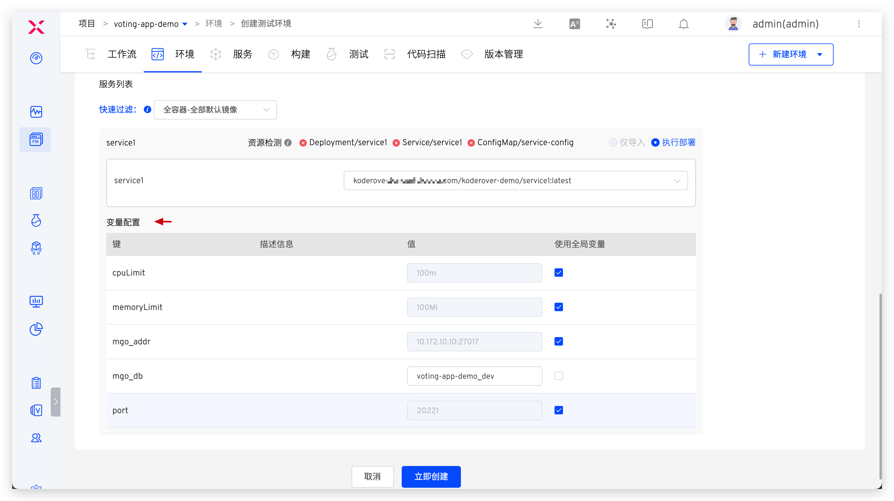
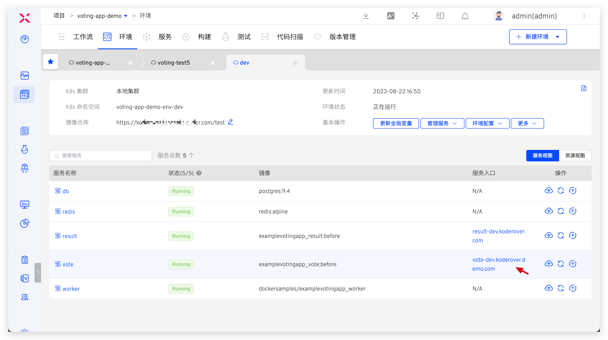

本文介绍如何使用 Zadig 创建多套业务数据隔离的环境。Zadig 支持一套服务配置创建多个环境，通常情况下，会有以下几个问题需要解决：

1. 每个独立环境的业务数据需要区分开，存放在不同的数据库中
2. 不同的独立环境需要有不同的访问地址

Zadig 提供了系统内置变量和自定义变量来区分不同环境的不同变量值。下面具体介绍以上问题在 Zadig 系统中的实践。

## 数据库隔离
如果你的服务中用到了数据库，在创建多个环境时，一定希望不同环境的业务数据是隔离的，那么可以结合 Zadig 系统内置变量和自定义变量来解决这个问题，下面举个例子来详细说明。


图中所选服务需要做数据存储，在服务配置中有数据库的相关配置，现在需要实现数据的隔离，配置过程如下：
* 服务配置中将数据库变量抽取出来，作为自定义变量 `mgo_db`，在服务 YAML 中引用该变量，该变量值在创建环境和更新环境的时候自动渲染到服务 YAML 中。
* 在自定义变量中使用系统内置变量 `$Product$_$EnvName$`。其中 `$Product$` 和 `$EnvName$` 都是系统内置变量，在创建和更新环境的时候自动传入对应的变量值然后渲染到服务配置里。比如当前项目名称为 `voting-app-demo`，创建的环境名称为 `dev`，在创建环境的时候 `$Product$_$EnvName$` 组合渲染出来的值为`voting-app-demo_dev`。

创建环境时，也可以按需修改自定义变量值，基于一份服务 YAML 实现不同环境的差异化配置。



## 域名区分
在 Zadig 环境中要想创建多套环境，使用不同的访问地址，可以按照以下步骤来配置：
1. 给集群入口配置一个泛域名，比如：*.abc.com，确保域名 dns 正确解析到集群 [Ingress 控制器](https://kubernetes.io/zh/docs/concepts/services-networking/ingress-controllers/) LoadBalancer 的外网 IP 上，Ingress 控制器的外网 IP 可以通过以下命令获得。

``` bash
kubectl get svc --all-namespaces| head -1;kubectl get svc --all-namespaces|grep ingress-controller
```
执行结果如下图所示。


2. 入口服务，使用变量配置 Ingress host。


如上图所示，
1. 定义变量`vote_domain`，变量值为`vote-$EnvName$.koderover.demo.com`（我们预先已经配置泛域名 `*.koderover.demo.com` dns 解析到当前集群入口）
2. 在`vote`服务 YAML 中引用该变量<span v-pre>`{{.vote_domain}}`</span>
3. 在`vote_domain`变量中，我们使用系统内置变量`$EnvName$`，在创建环境时该变量值会被系统渲染成对应的环境名称。

完成配置后，创建一套名称为`dev`的环境。如下图所示，生成的访问地址为`vote-dev.koderover.demo.com`。



关于变量的更多功能可参考文档：[变量配置](/Zadig%20v2.0.0/project/service/k8s/#变量配置)。
