## 概述

[项目](/ZadigX%20dev/quick-start/concepts/#项目)是 ZadigX 中的一个核心概念，项目搭建完毕后，团队便可以在项目中进行代码部署、集成测试验证、服务上下线、版本发布等操作。

管理服务配置、构建配置等操作的复杂度和维护成本会随着服务数量的增多而增大，ZadigX 支持使用模板来统一管理服务配置和构建，最大程度地减少重复工作。

本手册可帮助你快速高效地搭建项目、配置项目。

## 项目接入方式

ZadigX 支持三种接入方式：

- [现有项目托管](#现有项目托管)：已有服务 YAML 配置并未做管理（比如服务部署通过云厂商控制台实现，或直接在 Jenkins 中通过脚本组装生成 YAML）。在这种场景下，通过现有项目托管的方式，可以快速拉起不同业务域的项目，给开发测试运维一个协同平面，实现高效的业务开发和交付。
- [现有项目导入](#现有项目导入)：已有服务的 YAML/Helm Chart 配置已经通过 Git 仓库、Chart 仓库或者其他存储介质管理。使用 ZadigX 导入已有服务配置和已有环境，实现迭代过程和发布过程的自动化。
- [新项目接入](#新项目接入)：对于需要搭建工程体系的新项目，使用现有模板来统一管理服务配置和构建，实现标准化规范化运维。

下面展开介绍每种方式的接入步骤。

### 现有项目托管

1. 新建项目 -> 选择托管项目。

2. 配置托管环境，从指定集群、指定命名空间中选择服务导入。

3. 配置服务构建，参考文档：[构建](/ZadigX%20dev/project/build/#zadig-构建)。
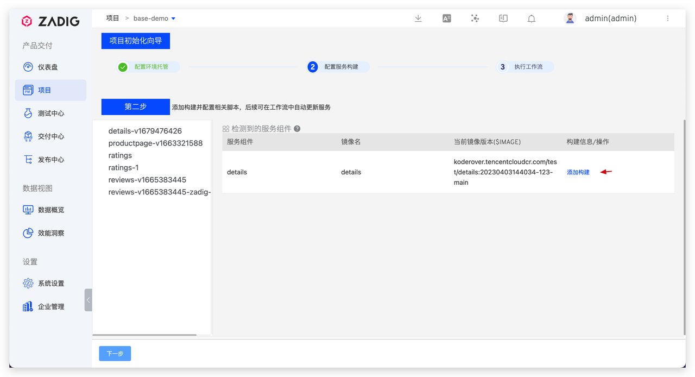

4. 执行工作流，部署更新指定环境中的服务。

::: tip
若后续需要在 ZadigX 上管理服务配置，可以一键切换项目类型，切换成 K8s YAML 项目，参考文档：[切换项目类型](/ZadigX%20dev/project/host-k8s-resources/#托管项目切换-k8s-yaml-项目)。
:::

### 现有项目导入

就配置文件的两种形式（YAML / Helm Chart）分别介绍接入步骤。

#### YAML 形式

1. 新建项目，选择 K8s YAML 项目。

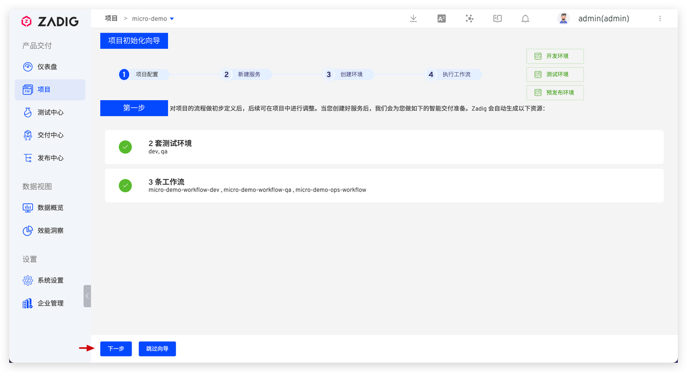

2. 新建服务：从代码库中同步服务配置，参考文档：[新建服务](/ZadigX%20dev/project/service/k8s/#新建服务)。

3. 新建环境：选择已有命名空间新建环境（比如：dev/sit/uat/prod 环境），参考文档：[新建环境](/ZadigX%20dev/project/env/k8s/#创建环境)。

4. 配置构建：进入项目 -> 构建，配置服务构建脚本，参考文档：[构建](/ZadigX%20dev/project/build/#zadig-构建)。

5. 执行工作流：进入项目 -> 工作流，运行工作流更新指定环境的服务。

#### Helm Chart 形式

1. 新建项目，选择 K8s Helm Chart 项目。

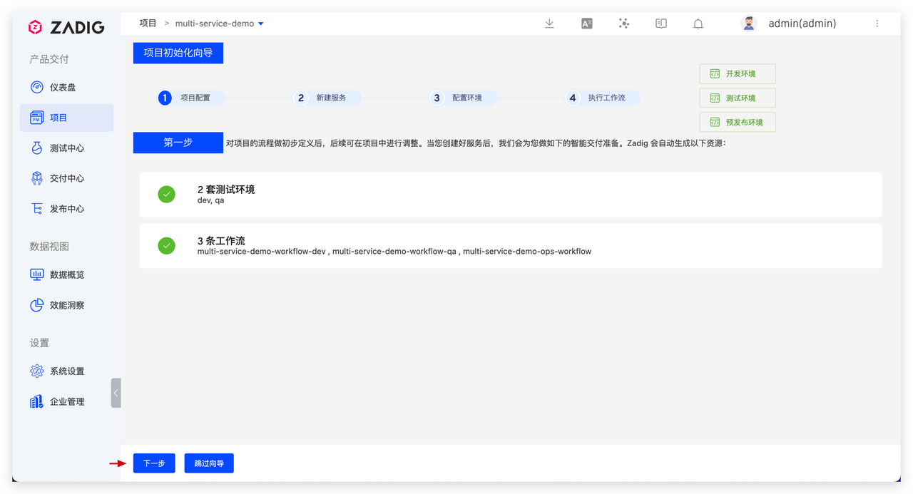

2. 新建服务：从代码库中同步服务配置，参考文档：[新建服务](/ZadigX%20dev/project/service/helm/chart/#从代码库同步服务)。

3. 新建环境：选择已有命名空间新建环境（比如：dev/sit/uat/prod  环境），参考文档：[新建环境](/ZadigX%20dev/project/env/k8s/#创建环境)。
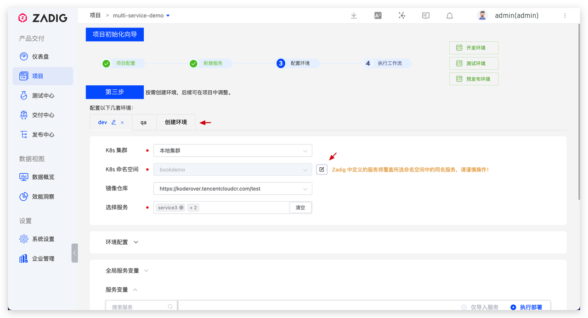

4. 配置构建：进入项目 -> 构建，配置服务构建脚本，参考文档：[构建](/ZadigX%20dev/project/build/#zadig-构建)。
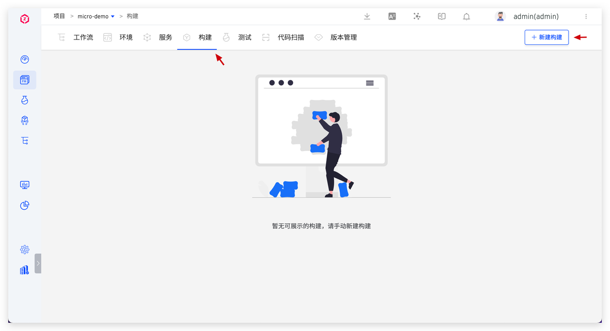

5. 执行工作流：进入项目 -> 工作流，执行工作流更新指定环境的服务。工作流的更多功能可参考文档：[工作流](/ZadigX%20dev/project/workflow/)。
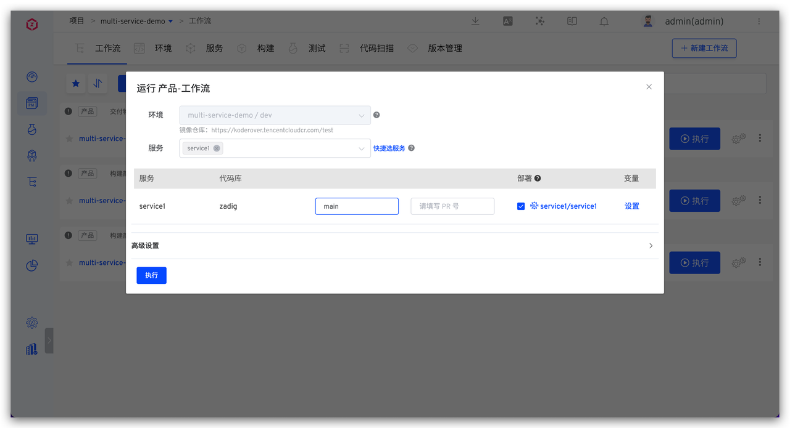

### 新项目接入

就配置文件的两种形式（YAML / Helm Chart）分别介绍接入步骤。

#### YAML 形式

1. 新建项目：选择 K8s YAML 项目。

2. 新建服务：使用模板新建服务，参考文档：[新建服务](/ZadigX%20dev//project/service/k8s/#使用模板新建服务)。
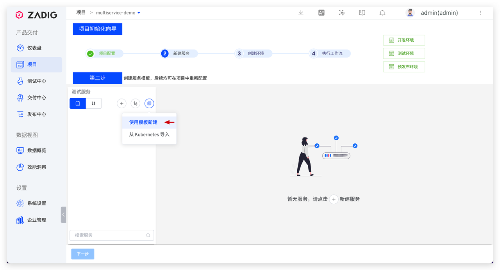

3. 新建环境：选择服务新建 dev/sit/uat/prod 环境。
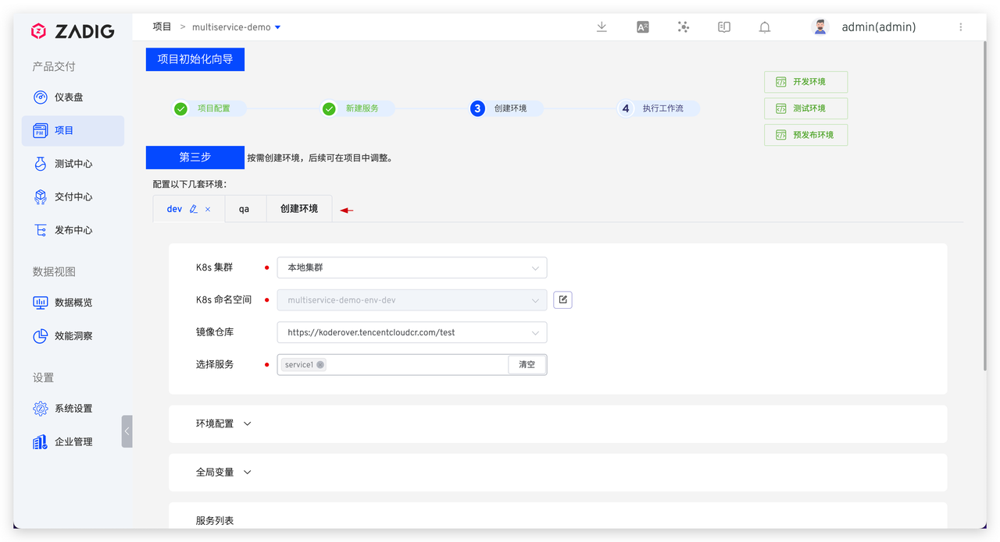

4. 配置构建：使用构建模板配置构建脚本，参考文档：[构建](/ZadigX%20dev/project/build/#zadig-构建)。

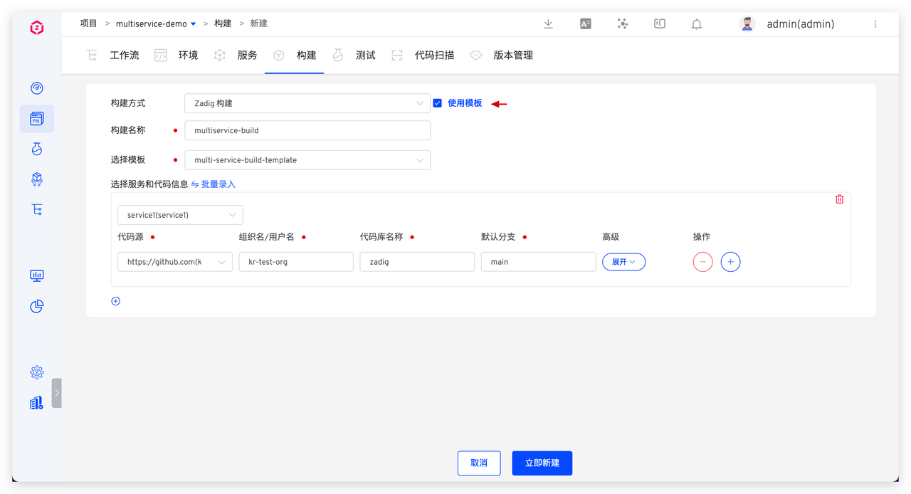

5. 配置工作流：配置测试和生产环境对应工作流，参考文档：[工作流](/ZadigX%20dev/project/common-workflow/)。
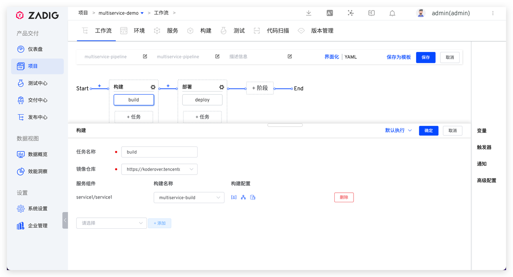

#### Helm Chart 形式

1. 新建项目：选择 K8s Helm Chart 类型项目。

2. 新建服务：使用模板新建服务，参考文档：[新建服务](/ZadigX%20dev/project/service/helm/chart/#使用模板新建单个服务)。

3. 新建环境：选择服务新建 dev/sit/uat/prod 环境。

4. 配置构建：使用构建模板配置构建脚本，参考文档：[构建](/ZadigX%20dev/project/build/#zadig-构建)。

5. 配置工作流：配置测试环境和生产环境对应工作流，参考文档：[工作流](/ZadigX%20dev/project/common-workflow/)。

## 标准模板管理

包括服务模板、构建模板、Dockerfile 模板、工作流模板。

### 服务模板

::: tip 适用场景
多个服务的配置文件内容结构同构，只是具体配置不同。比如：不同服务的端口号/副本数/数据库连接地址等不同。将服务的配置抽象成通用的 K8s YAML/Helm Chart 模板，支持用户在通用模板上创建多个服务。
:::

就服务配置的不同组织形式（K8s YAML/Helm Chart）分别介绍。

#### K8s YAML 模板

准备工作：将多个服务的配置抽象成 K8s YAML 模板，以下为 multi-service-demo 项目的相关配置供参考。更多使用姿势可参考文档：[K8s YAML 模板](/ZadigX%20dev//template/k8s_yaml/)、[使用模板创建服务](/ZadigX%20dev/project/service/k8s/#使用模板新建服务)。
- 三个微服务的 K8s YAML 配置：[service1](https://github.com/koderover/zadig/tree/main/examples/multi-service-demo/k8s-yaml/service1)、[service2](https://github.com/koderover/zadig/tree/main/examples/multi-service-demo/k8s-yaml/service2)、[service3](https://github.com/koderover/zadig/tree/main/examples/multi-service-demo/k8s-yaml/service3)
- 对上述三个服务配置抽象的模板：[K8s YAML 模板](https://github.com/koderover/zadig/blob/main/examples/multi-service-demo/k8s-yaml/template.yaml)。
1. 新建模板：访问模板库 -> K8s YAML -> 创建模板，输入模板内容后保存。

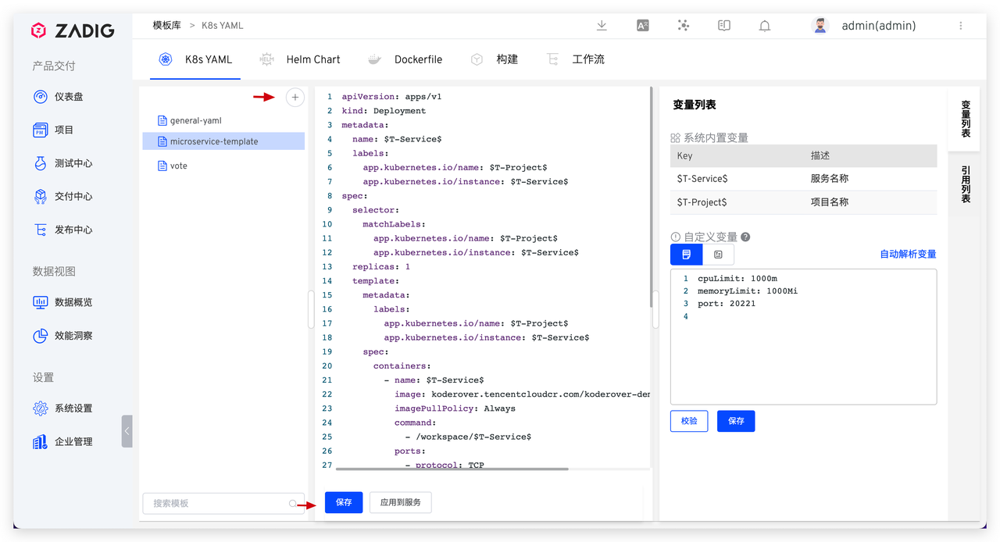

2. 配置自定义变量：自动解析变量，按需配置变量默认值。
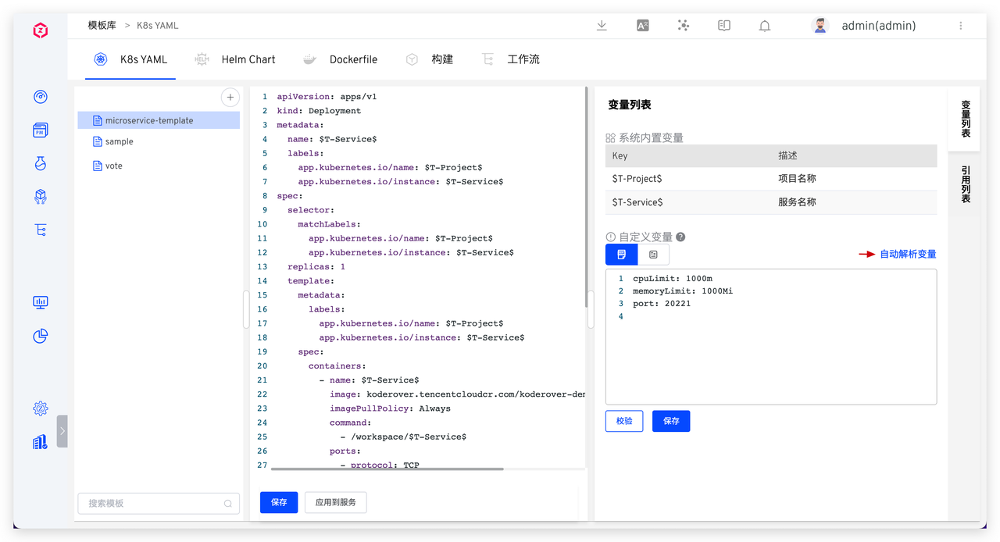

3. 使用模板创建服务。
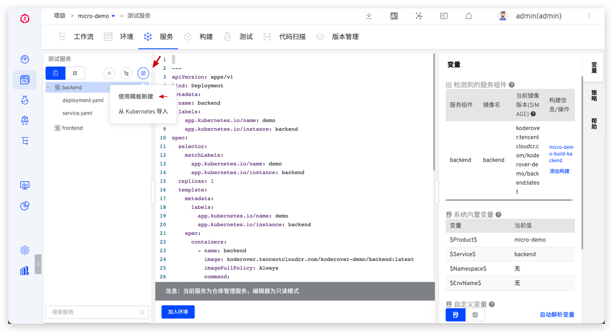

4. 模板内容变更同步更新服务配置：服务配置中开启自动同步，模板内容变更后，应用到服务
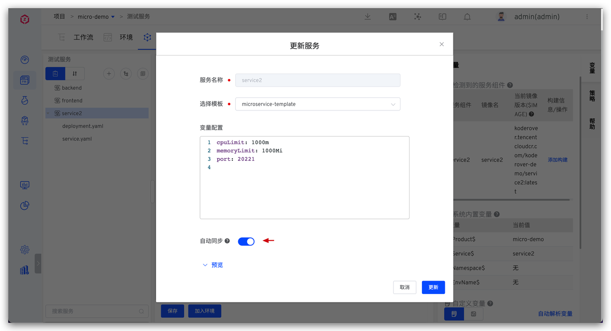

#### Helm Chart 模板

准备工作：将多个服务的 Helm Chart 配置抽象成 Helm Chart 模板，以下为 multi-service-demo 项目的相关配置供参考。更多使用姿势可参考文档：[Helm Chart 模板](/ZadigX%20dev/template/helm_chart/)、[使用模板创建服务](/ZadigX%20dev/project/service/helm/chart/#使用模板新建单个服务)。
- 三个微服务的 Helm Chart 配置：[service1](https://github.com/koderover/zadig/tree/main/examples/multi-service-demo/full-charts/service1)、[service2](https://github.com/koderover/zadig/tree/main/examples/multi-service-demo/full-charts/service2)、[service3](https://github.com/koderover/zadig/tree/main/examples/multi-service-demo/full-charts/service3)。
- 对上述三个服务 Helm Chart 配置抽象的模板：[Helm Chart 模板](https://github.com/koderover/zadig/tree/main/examples/multi-service-demo/general-chart)。
1. 新建模板：访问模板库 -> K8s YAML -> 创建模板，输入模板内容后保存。

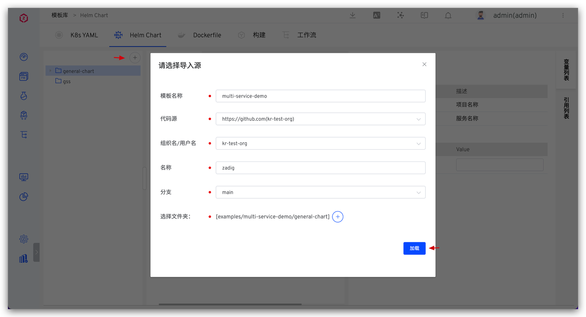

2. 配置自定义变量：按需配置变量默认值后保存。

3. 使用模板创建服务：进入  K8s Helm Chart 项目 -> 服务 -> 使用模板新建，填写参数后导入即可。
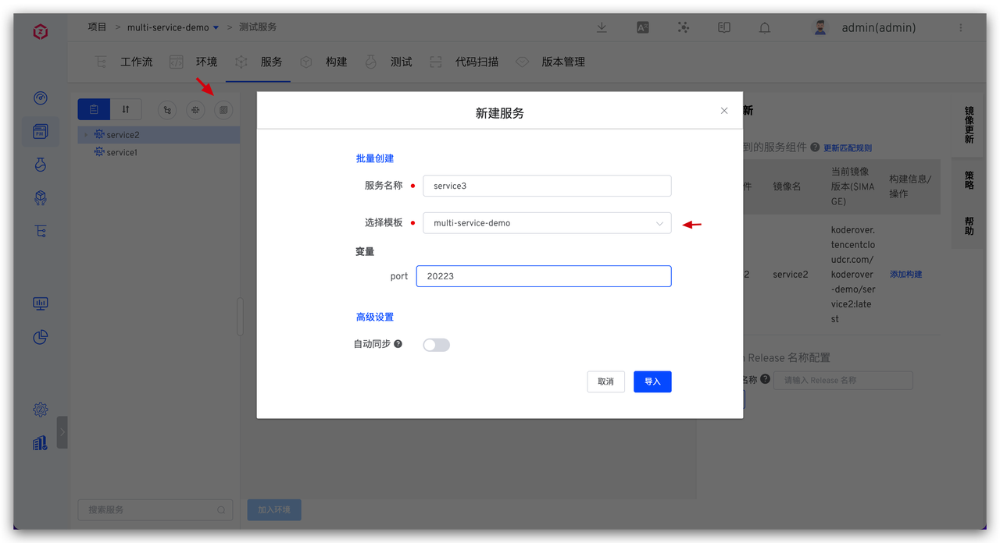

4. 模板内容变更同步更新服务配置：服务配置中开启自动同步，模板内容变更后，应用到服务。
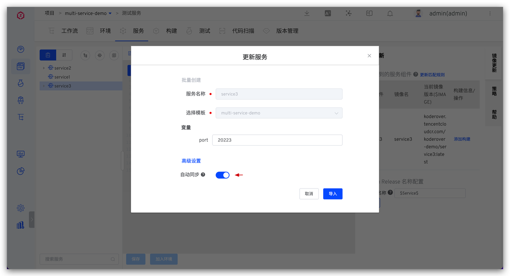

### Dockerfile 模板

准备工作：将多个服务的镜像构建配置抽象为 Dockerfile 模板，以下为 multi-service-demo 项目的相关配置供参考。更多使用姿势可参考文档：[Dockerfile 模板](/template/dockerfile/)、[构建配置](/ZadigX%20dev/project/build/#更多构建步骤)。
- 三个微服务的源码：[服务源码](https://github.com/koderover/zadig/tree/main/examples/multi-service-demo/src)。
- 上述三个服务的工程编译文件：[Makefile](https://github.com/koderover/zadig/blob/main/examples/multi-service-demo/Makefile)。
- 对上述三个服务的镜像构建配置进行抽象：[Dockerfile 模板](https://github.com/koderover/zadig/blob/main/examples/multi-service-demo/Dockerfile)。
1. 新建模板：访问模板库 -> Dockerfile 模板 -> 创建模板，输入模板内容后保存。
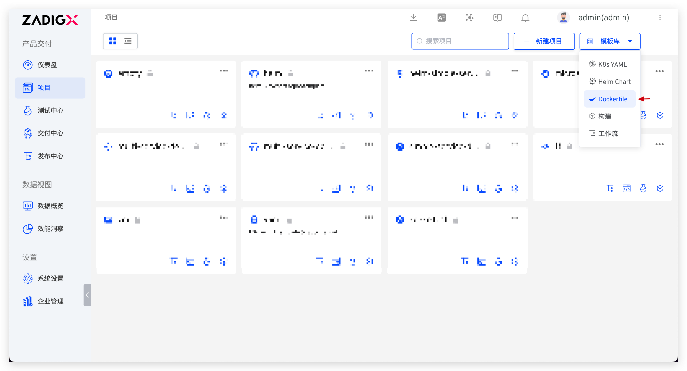
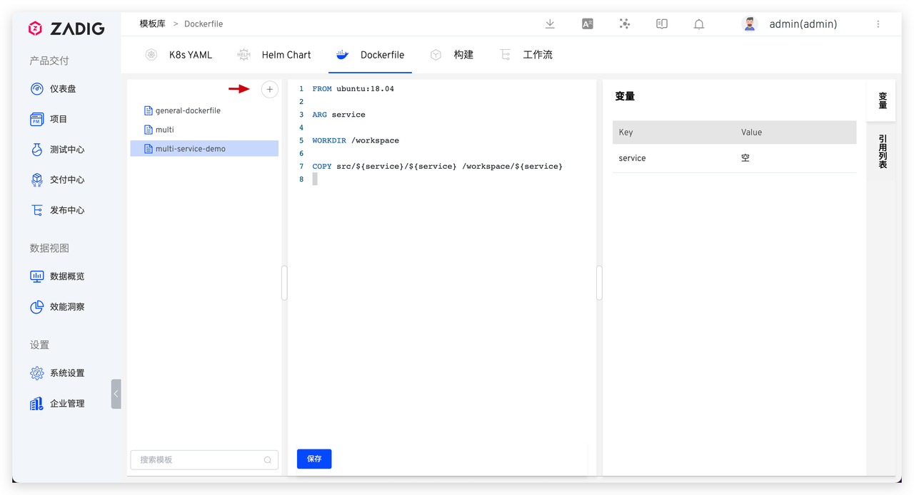

2. 使用 Dockerfile 模板为服务配置构建。

### 构建模板

::: tip 适用场景
多个服务的构建配置同构（比如相同技术栈的多个服务代码分别在单独的代码库中维护，构建所依赖的软件包相同、构建脚本同构，只有代码信息有区别...）使用 ZadigX 构建模板来提升配置构建的效率，具体可参考文档：[构建模板](/ZadigX%20dev/template/build/)。
:::

1. 新建构建模板：访问模板库 -> 构建 -> 创建模板，配置完毕后保存。
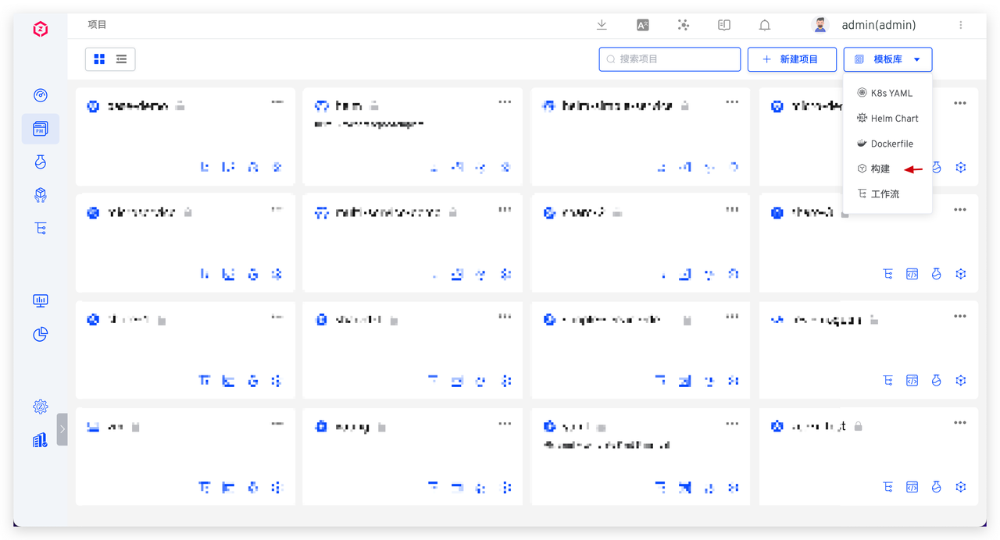

2. 使用构建模板：使用模板配置构建，分别配置多个服务构建所需的代码信息。对于多个服务使用同一构建模板的情况，可使用批量录入快速配置，参考文档：[批量录入](/ZadigX%20dev/project/build/#批量录入)。

### 工作流模板

根据项目流程抽象工作流模板，基于模板快速创建工作流，具体参考文档：[工作流模板](/ZadigX%20dev/template/workflow/)。

## 权限管理

在权限管理中定义项目的成员和权限。

### 项目权限配置

访问项目配置 -> 权限，配置角色和项目成员即可，可参考文档：[权限配置](/ZadigX%20dev/project/config/#权限配置)。

### 协作模式配置

访问项目配置 -> 协作模式，配置协作成员以及工作流、环境资源的权限即可，具体配置过程参考：[协作模式](/ZadigX%20dev/project/config/#协作模式)。

## 进阶使用

### 如何区分出不同环境的镜像？

**场景描述**

1. 服务的镜像构建在 ZadigX 系统中完成，外部系统（比如：企业内部的发布系统）使用 ZadigX 中构建出的镜像来部署生产环境。
2. dev 环境用于研发日常自测联调，对应的服务镜像版本未经过严格的质量保证。
3. sit 环境用于系统集成测试验收，验收通过后的镜像可用于部署生产环境。

两个环境的镜像如何区分开，以便外部系统识别呢？

**解决路径**

以下 3 种路径都可以解决以上问题：

1. 在系统中集成多个镜像仓库，两个环境分别使用不同的镜像仓库，参考文档：[集成镜像仓库](/ZadigX%20dev/settings/image-registry/)、[环境的基本信息](/ZadigX%20dev/project/env/k8s/#基本信息-2)。
2. 对于产品工作流，在服务策略中修改镜像名称规则，使用 `ENV_NAME` 变量来区分不同环境的镜像信息，参考文档：[交付物命名规则设置](/ZadigX%20dev/project/service/k8s/#策略配置)。
3. 对于自定义工作流：
    - 在构建配置中增加自定义变量 `ENV_NAME`，在构建镜像之前修改 `IMAGE` 变量的值，让它和 `ENV_NAME` 联系起来，比如：`export IMAGE=$IMAGE-$ENV_NAME`，参考文档：[自定义变量](/ZadigX%20dev/project/build/#构建变量)。
    
    - 在工作流中增加全局变量，值设置为运行时输入，参考文档：[工作流变量](/ZadigX%20dev/project/common-workflow/#工作流)。

    - 修改构建任务的构建变量配置，使用上一步中的全局变量来为 `ENV_NAME` 赋值，参考文档：[构建任务变量](/ZadigX%20dev/project/common-workflow/#构建任务)。

### 如何规避因人为失误导致部署错服务？

可以通过配置自定义工作流来避免。

1. 为每一个服务配置一条自定义工作流，专门用来构建部署该服务。
2. [推荐]在一条自定义工作流里构建部署多个服务，在部署之前增加审批操作，通过后才会开始执行部署任务。审批配置可参考文档：[人工审批](/ZadigX%20dev/project/common-workflow/#人工审批)。