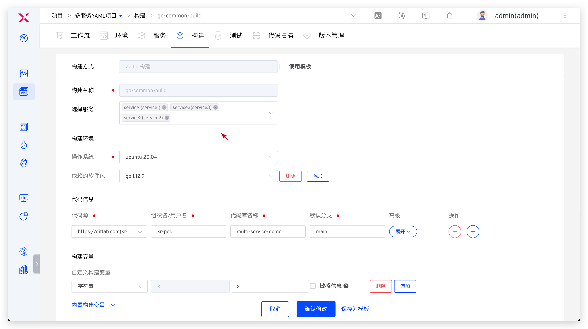
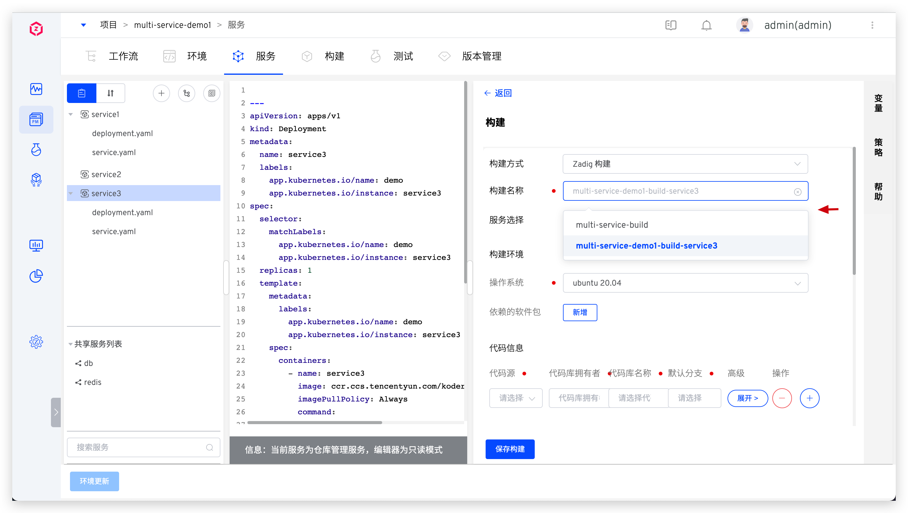
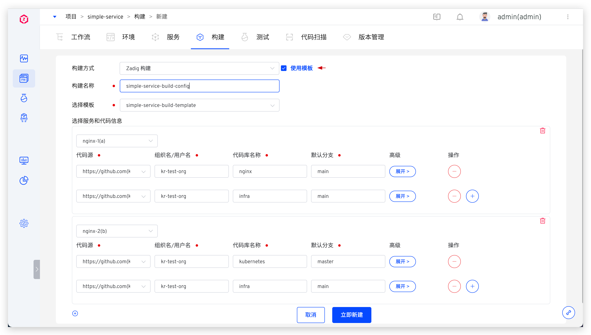

ZadigX 构建是基于容器运行时环境提供的高效云原生构建引擎，内置了常见的构建环境及软件包、缓存机制，支持多个服务共享构建脚本、共享全局构建模板及 Jenkins 构建的调用，还可以通过自定义[构建镜像](/ZadigX%20dev/settings/custom-image) 及 [安装软件包](/ZadigX%20dev/settings/app/) 满足更为丰富的构建场景。

ZadigX 构建过程包含通用配置、构建环境、代码信息、构建变量、通用构建脚本、高级配置以及自定义更多步骤配置等。


## Zadig 构建

- 支持为一个服务配置多个构建，在工作流配置中按需选择。
    - 产品工作流：[构建部署配置](/ZadigX%20dev/project/workflow/#构建部署)。
    - 自定义工作流：[构建任务配置](/ZadigX%20dev/project/workflow-jobs/#构建任务)。
- 支持多个服务使用一份构建配置，更多细节请阅读[共享构建](#zadig-共享构建)。
- 支持修改构建交付物的生成规则，更多细节请阅读[构建交付物生成规则](/ZadigX%20dev/project/service/k8s/#策略配置)。

::: tip 准备工作
明确构建所需要的依赖，依赖项包括但不限于：
- 服务编译的代码依赖（比如依赖 Base 库，开源库等）
- 服务编译的环境依赖（比如 Go 版本、Node 版本、编译工具等）
- 服务编译的系统依赖（比如操作系统等）
:::

### 基本配置


参数说明：
- `构建名称`：构建的名称，有意义便于理解即可。
- `服务选择`：选择使用该构建配置的服务。

### 构建环境

配置构建过程运行时的环境。


参数说明：
- `操作系统`：平台默认提供 Ubuntu 18.04 / Ubuntu 20.04 作为基础构建系统。

::: tip 扩展知识

1. 支持自定义添加构建环境作为构建系统，详情请参阅[构建镜像管理](/ZadigX%20dev/settings/custom-image/#步骤-1-生成构建镜像)。
2. 默认提供的 Ubuntu 系列构建系统中已安装了以下工具/命令，可以在[软件包管理](/ZadigX%20dev/settings/app/)和构建脚本中直接使用。

    - build-essential
    - cmake
    - curl
    - docker
    - git
    - libfontconfig
    - libfreetype6-dev
    - libpcre3-dev
    - librrd-dev
    - libsasl2-dev
    - netcat-openbsd
    - pkg-config
    - python
    - tar
    - wget
:::

- `依赖的软件包`：构建过程中需要用到的各类软件包工具，比如不同版本的 Java、Go、Govendor、Node、Bower、Yarn、Phantomjs 等等。

::: tip 扩展知识
- 选择软件包的过程中需要注意多个软件包之间的依赖关系，按照顺序进行安装。例如：Govendor 依赖 Go，那么必须先选 Go，再选择 Govendor。<br>
- 平台已内置一些常见的软件包，如果有其他软件包或者版本需求，系统管理员可以在[软件包管理](/ZadigX%20dev/settings/app)中配置其安装脚本。
:::

### 代码信息


参数说明：
- `代码源`：代码库所在的平台，支持的代码源请参考：[代码源信息](/ZadigX%20dev/settings/codehost/overview/#功能兼容列表)
- `代码库拥有者`：支持开源库，以及所配置的代码源下的代码库拥有者
- `代码库名称`：代码库的名称。对于 Gerrit 代码源，支持模糊匹配，如上图例中所示
- `默认分支`：执行工作流对服务进行构建时，默认选取的分支
- `Remote name`：指定远程代码仓库的名称，默认 `origin`
- `克隆目录名`：定义代码库被克隆后的目录名称，默认为代码库的名称
- `子模块`：同步 `submodule` 中配置的代码库
- `执行时显示`：默认开启，若设置为关闭，执行工作流时不显示该代码库选项，代码配置使用默认值

:::: tip
- 指定`克隆目录名`为 A，则代码库的内容将会被克隆到 `$WORKSPACE/A` 中
- `$WORKSPACE` 是 ZadigX 系统构建模块内置的变量，关于其更详细的描述可阅：[系统内置环境变量](/ZadigX%20dev/project/build/#构建脚本)
::::

### 构建变量

包括系统内置构建变量和用户自定义构建变量，可在构建脚本中直接使用。

> 提示：在 [通用构建脚本](#通用构建脚本) 中添加 `env` 命令可查看所有构建变量。


**内置构建变量**

内置变量及其描述说明如下：

|变量名称|描述|
|-------|---|
|`WORKSPACE`|当前工作流工作目录|
|`WORKFLOW`|执行构建的工作流标识|
|`PROJECT`|项目标识|
|`TASK_ID`|当前工作流任务的 ID，即任务序号|
|`IMAGE`|系统按照内置规则生成的镜像名称，用于容器服务的部署更新，可以在服务的[策略配置](/ZadigX%20dev/project/service/k8s/#策略配置)中修改其命名规则|
|`PKG_FILE`|系统按照内置规则生成的交付物文件名称，可修改其命名规则，可以在服务的[策略配置](/ZadigX%20dev/project/service/k8s/#策略配置)中修改其命名规则|
|`SERVICE`|构建的服务名称|
|`SERVICE_MODULE`|构建的服务组件名称|
|`ENV_NAME`|环境名称|
|`BUILD_URL`|构建任务的 URL|
|`CI`|值恒等于 true，可视需要使用，比如用于判断是 CI 脚本，还是其他脚本|
|`Zadig`|值恒等于 true，可视需要使用，比如用于判断是否在 ZadigX 系统中执行|
|`REPONAME_<index>`|1. 获取指定 `<index>` 的代码库名称<br>2. 其中 `<index>` 为构建配置中代码的位置，初始值为 0<br>3. 下图例中，在构建脚本中使用 `$REPO_0` 即可获得第一个代码库的名称 `voting-app`|
|`REPO_<index>`|1. 获取指定 `<index>` 的代码库名称，并自动将名称中的中划线 `-` 替换为下划线 `_`<br>2. 其中 `<index>` 为构建配置中代码的位置，初始值为 0<br>3. 下图例中，在构建脚本中使用 `$REPO_0` 即可获得第一个代码库转化后的名称 `voting_app`|
|`<REPO>_PR`|1. 获取构建过程中指定 `<REPO>` 使用的 Pull Request 信息，使用时请将 `<REPO>` 替换为具体的代码库名称<br>2. 当 `<REPO>` 信息中含有中划线 `-` 时，需要将 `-` 替换为下划线 `_`<br>3. 下图例中希望获取 `voting-app` 库的 Pull Request 信息，使用 `$voting_app_PR` 或者 `eval PR=\${${REPO_0}_PR}` 即可<br>4. 若构建时指定了多个 PR，比如指定的 PR ID 为 1、2、3，则该变量的值为 `1,2,3` <br> 5. 当代码库为`其他`代码源时，不支持该变量|
|`<REPO>_BRANCH`|1. 获取构建过程中指定 `<REPO>` 使用的分支信息，使用时请将 `<REPO>` 替换为具体的代码库名称<br>2. 当 `<REPO>` 信息中含有中划线 `-` 时，需要将 `-` 替换为下划线 `_`<br>3. 下图例中希望获取 `voting-app` 库的分支信息，使用 `$voting_app_BRANCH` 或者 `eval BRANCH=\${${REPO_0}_BRANCH}`即可|
|`<REPO>_TAG`|1. 获取构建过程中指定 `<REPO>` 使用的 Tag 信息，使用时请将 `<REPO>` 替换为具体的代码库名称<br>2. 当 `<REPO>` 信息中含有中划线 `-` 时，需要将 `-` 替换为下划线 `_`<br>3. 下图例中希望获取 `voting-app` 库的 Tag 信息，使用 `$voting_app_TAG` 或者 `eval TAG=\${${REPO_0}_TAG}` 即可|
|`<REPO>_COMMIT_ID`|1. 获取构建过程中指定 `<REPO>` 使用的 Commit ID 信息，使用时请将 `<REPO>` 替换为具体的代码库名称<br>2. 当 `<REPO>` 信息中含有中划线 `-` 时，需要将 `-` 替换为下划线 `_`<br> 3. 下图例中希望获取 `voting-app` 库的 Commit ID 信息，使用 `$voting_app_COMMIT_ID` 或者 `eval COMMIT_ID=\${${REPO_0}_COMMIT_ID}` 即可<br> 4. 当代码库为`其他`代码源时，不支持该变量|
|`<REPO>_ORG`|1. 获取测试过程中指定 `<REPO>` 使用的组织/用户信息，使用时请将 `<REPO>` 替换为具体的代码库名称<br>2. 当 `<REPO>` 信息中含有中划线 `-` 时，需要将 `-` 替换为下划线 `_`<br> 3. 下图例中希望获取 `voting-app` 库的组织/用户信息，使用 `$voting_app_ORG` 或者 `eval ORG=\${${REPO_0}_ORG}` 即可|


**自定义构建变量**

说明：

- 支持使用字符串类型或者枚举类型的构建变量，自定义构建变量一旦创建后，其键值不可被修改。
- 可以设置字符串类型的变量为敏感信息，工作流任务的构建日志中不会输出敏感变量的值。
- 执行工作流任务时，可以对自定义构建变量的值进行修改，覆盖此处配置的默认值，如下图所示：


### 通用构建脚本

在通用构建脚本中声明代码的构建过程和实现。

> 可在通用构建脚本中使用[构建变量](#构建变量)


### 高级配置


说明：

- `策略配置`：配置构建服务的超时时间，若超过设置的时间阈值后构建仍未成功，则视为超时失败。
- `缓存配置`：开启缓存后，在工作流执行时会使用此处配置的缓存目录，目录配置可使用[构建变量](#构建变量)。
- `选择集群`：选择构建任务运行时所使用的集群资源，其中本地集群指 ZadigX 系统所在的集群，关于集群的集成可参考[集群管理](/ZadigX%20dev/pages/cluster_manage/)。
- `操作系统规格`：配置资源规格用于执行构建任务。平台提供 高/中/低/最低 四种配置供选择。此外，还可以根据实际需要自定义。
  - `GPU 资源自定义` ：可以根据需要输入 GPU 资源配置，详情可参照 [调度 GPU](https://kubernetes.io/zh-cn/docs/tasks/manage-gpus/scheduling-gpus/) 

        GPU 资源：vendorname.com/gpu:num
- `使用宿主机 Docker daemon`：开启后，构建执行过程中使用容器所在节点上的 Docker daemon 执行 docker 操作。

### 更多构建步骤

在`添加步骤`中可按需添加更多的构建步骤。


**镜像构建**

> 按照配置的参数构建镜像，使用内置变量 `IMAGE` 作为构建出的镜像产物名称，并自动将镜像推动到镜像仓库中。

参数说明：

- `构建上下文目录`: 执行 docker build 所在的目录。
- `Dockerfile 来源`: 包括`代码库`和`模板库`，模板库功能可参考 [Dockerfile 模板管理](/ZadigX%20dev/template/dockerfile/)。
- `Dockerfile 文件的绝对路径`: Dockerfile 来源于代码库时，指定执行 docker build 用到的 Dockerfile 路径。
- `模板选择`: Dockerfile 来源于模板库时，选择具体的 Dockerfile 模板。
- `构建参数`: 支持 docker build 的所有参数，比如：`--build-arg key1=value1 --build-arg key2=value2`。

上述参数中，除了 `Dockerfile 来源`和`模板选择`，其他的均可使用[变量](#构建变量)，但不支持两个变量套用的形式，比如 `${$REPO_0}_BRANCH`。

**二进制包存储**

配置构建出的二进制包产物的存储路径。

**文件存储**

上传指定文件到对象存储中。

- 上传后，文件将存储于对象存储对应 Bucket 的指定目录中，此处的目录可使用[变量](#构建变量)，但不支持两个变量套用的形式，比如 `${$REPO_0}_BRANCH`。
- 可指定文件的具体路径，如上图中的`infra/result.xml`，将会上传该指定文件。
- 也可指定到目录级别，如上图中的`infra/examples/`，将会上传 `infra/examples/` 目录下的所有文件（不包括子目录）到对象存储中。

**Shell 脚本执行**

新增 Shell 脚本执行步骤，按需自定义 Shell 脚本。

## Zadig 共享构建

> 同一个项目下的多个服务共享使用一份构建配置。

### 如何配置共享构建

以 [multi-service-demo](https://github.com/koderover/zadig/tree/main/examples/multi-service-demo) 为例，该项目包括 3 个 Golang 服务 service1/service2/service3，和构建相关的目录结构说明如下：

``` bash
├── Dockerfile # 定义 3 个服务的 Dockerfile
├── Makefile   # 定义 3 个服务的编译
├── src        # 3 个服务的源代码
   ├── service1
   ├── service2
   └── service3
```

创建 ZadigX 构建，`服务选择`中选择多个服务，按需配置构建环境、代码信息、通用构建脚本等，利用系统提供变量实现构建的共享，本示例中的构建脚本如下：

```bash
cd zadig/examples/multi-service-demo
make build-$SERVICE
docker build -t $IMAGE -f Dockerfile --build-arg service=$SERVICE .
docker push $IMAGE
```


### 如何使用共享构建

- 创建构建配置时指定多个服务，或者创建构建完毕后修改构建，在`服务选择`中选择多个服务。




- 也可以在为服务配置构建时，按需选择复用已有的构建配置实现构建共享。



## Zadig 构建模板
当大量服务的构建配置同构时（比如相同技术栈的多个服务代码分别在单独的代码库中维护，构建所依赖的软件包相同、构建脚本同构，只有代码信息有区别），可使用 ZadigX 构建模板来提升配置构建的效率。

### 表单输入

1. 创建构建模板，在模板中完成代码库信息之外的所有配置，可参考[新建构建模板](/ZadigX%20dev/template/build/#新建模板)。
2. 创建 ZadigX 构建，选择`使用模板` -> 填写构建名称并选择构建模板 -> 选择服务并按需配置代码信息后保存即可。

> 代码信息中的相关参数说明可参考：[代码信息说明](/ZadigX%20dev/project/build/#代码信息)。



### 批量录入

点击`批量录入`，可批量配置使用模板的服务和代码仓库信息


::: tip 注意
- 格式：服务组件(服务),代码源标识,带分支信息的代码库 URL
- 例如：aslan(zadig),koderover,https://github.com/koderover/zadig/tree/main
- 确保代码源在 ZadigX 中已经成功集成，集成方式参考文档[代码源集成](/ZadigX%20dev/settings/codehost/overview)
- 一行一条数据
- 支持的代码源请参考：[代码源信息](/ZadigX%20dev/settings/codehost/overview/#功能兼容列表)
:::

## Jenkins 构建
> 直接使用 Jenkins Job 执行后的镜像产物，用于部署更新 ZadigX 中的服务。

关于`Zadig 构建`和 `Jenkins 构建` 二者的区别如下：

- ZadigX 构建：在 ZadigX 平台中定义服务的完整构建过程。
- Jenkins 构建：关于服务具体的构建过程在 Jenkins 中定义执行，ZadigX 中提供入口触发具体的 Jenkins Job，并基于 Jenkins Job 的镜像产物对部署在 ZadigX 中的服务进行更新。

### 前提
1. 需要先在 ZadigX 系统中集成 Jenkins 服务器，详见 [Jenkins 集成](/ZadigX%20dev/settings/jenkins)。
2. 需要先在 ZadigX 系统中集成镜像仓库，详见[镜像仓库管理](/ZadigX%20dev/settings/image-registry/)。
3. 要使用的 Jenkins Job 中需要配置 Build Parameters，包含 `IMAGE` 变量，作为构建出的镜像产物， 并将 `IMAGE` 推送至集成的镜像仓库中，示例如下：


### 如何使用


新建构建，构建来源选择 `Jenkins 构建`，填写相关参数保存即可。参数说明如下：
- `服务选择`：要构建的服务。
- `jenkins job`：从集成的 Jenkins Server 中按需选择 Jenkins Job。
- `构建超时`：超过设定的时间后，工作流执行构建仍未结束则视为构建超时。
- `构建参数`：会自动解析出对应 Jenkins Job 中的参数项，可在 ZadigX 平台中做修改。说明如下：
    - `IMAGE` 参数：即为[前提](#前提)中的 `IMAGE` 变量，运行工作流时会传递给对应的 Jenkins Job 作为构建镜像产物名称。支持使用系统内置变量来为其赋值，参考[策略配置](/ZadigX%20dev/project/service/k8s/#策略配置)。
    - 枚举类型的参数：可修改枚举类型参数的可选值。注意：可选值需要在 Jenkins Job 中支持。以下图中的 Jenkins Job 参数配置为例，则此处可在 ZadigX 中修改枚举参数 `ParallelNum` 的可选值为 1,2,3,4。


