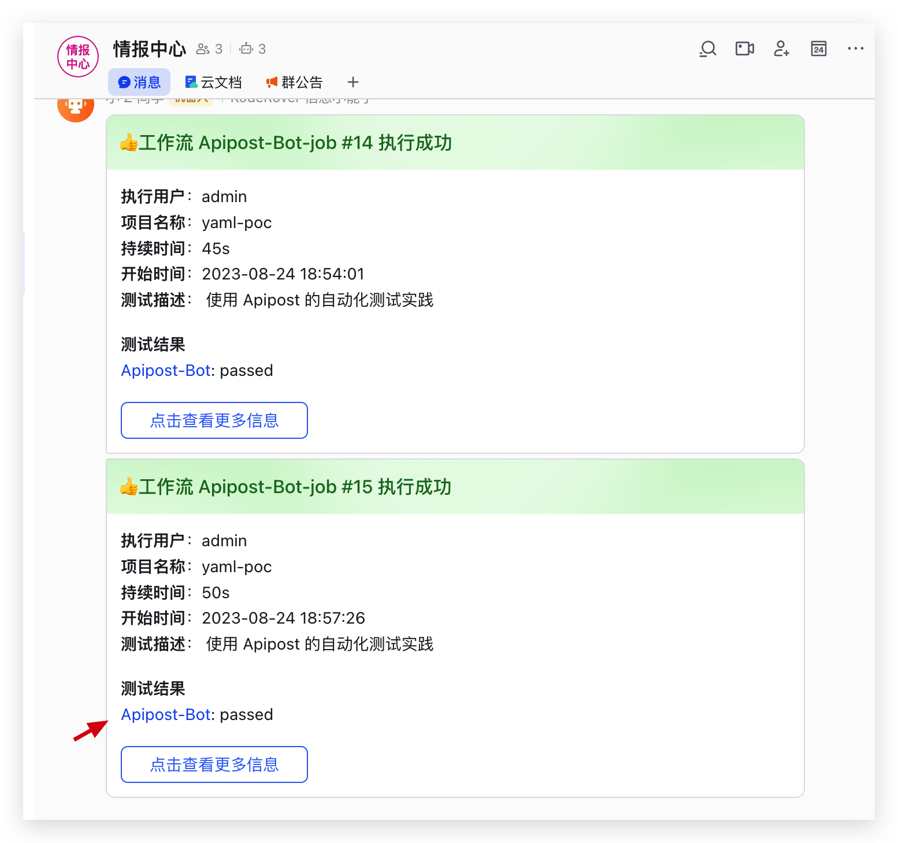
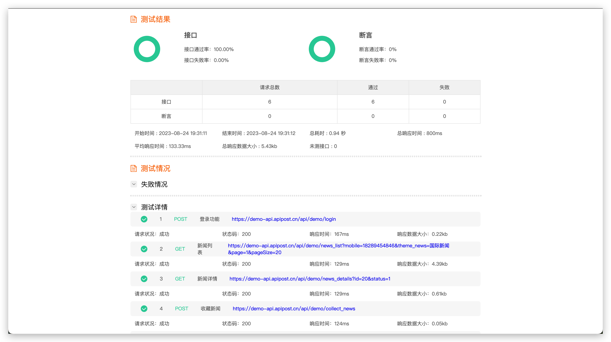
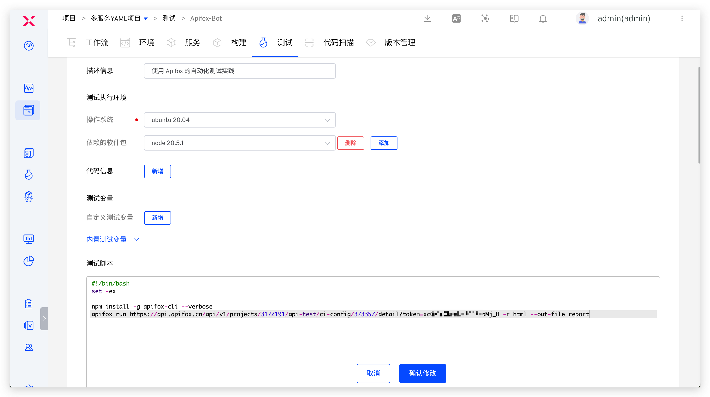
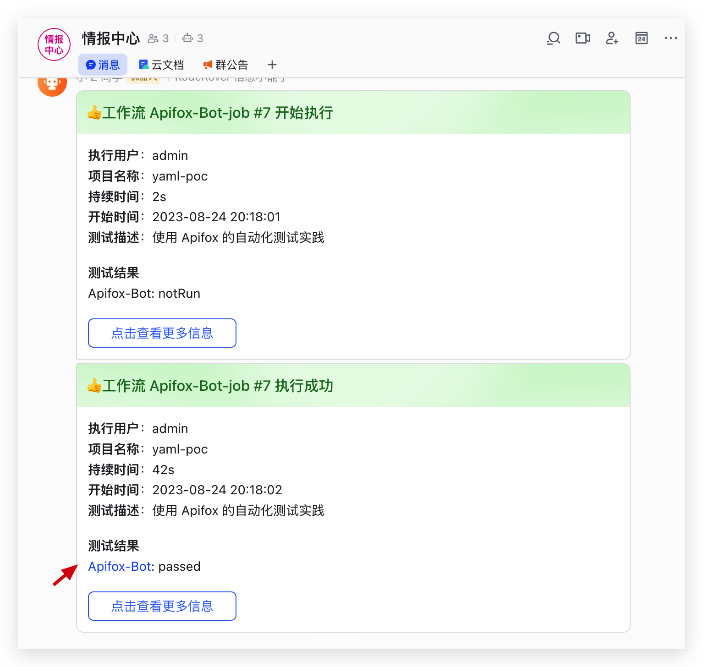
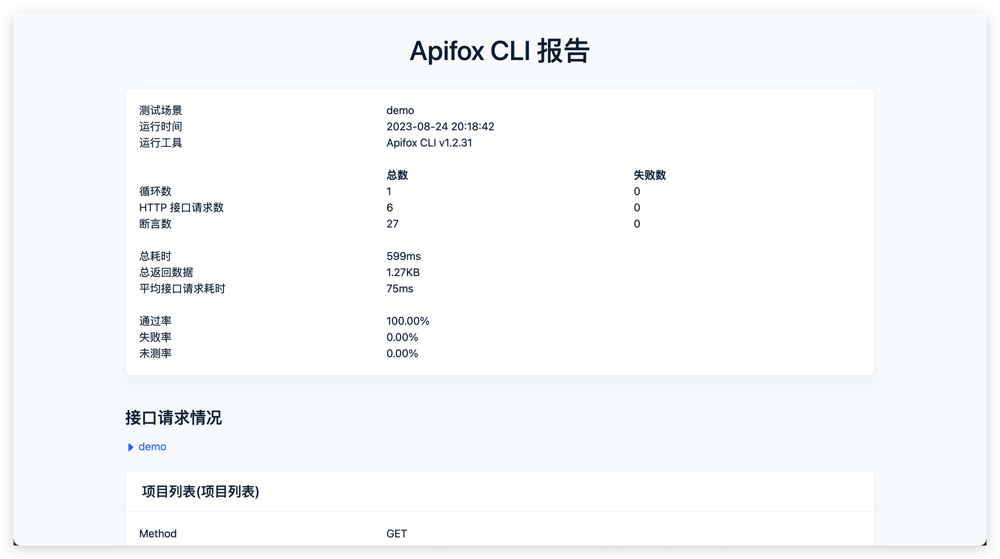

本文主要介绍 Apipost、Apifox 等测试平台如何接入 ZadigX 使用。

## Apipost

### 第一步：在 Apipost 中配置 CICD 命令

访问 Apipost 自动化测试 -> 测试用例，点击右侧的 CICD，新增 CICD 配置后复制命令。


### 第二步：在 ZadigX 中配置 Nodejs

ZadigX 系统管理员访问系统设置 -> 集成管理 -> 软件包管理，新增软件包。


具体配置如下：
- `名称`：`node`
- `版本`：`20.5.1`
- `Bin Path`：`$HOME/node/bin`
- `启用`：开启
- `Bin Path`：`https://nodejs.org/dist/v20.5.1/node-v20.5.1-linux-x64.tar.xz`
- `安装脚本`：内容如下

::: details
``` bash
sudo apt-get update
sudo apt install software-properties-common -y
mkdir -p $HOME/node 
tar -C $HOME/node -xJf ${FILEPATH} --strip-components=1 
npm config --global set registry https://registry.npm.taobao.org
```
:::

### 第三步：在 ZadigX 中配置测试

新增测试，配置软件包、测试脚本、Html 报告文件地址以及 IM 通知。


**软件包**

第二步中配置的 `node 20.5.1`

**测试脚本**

第一步中复制的 CICD 命令，注意需要对 URL 增加转义，并增加 `--out-file=report` 指定测试报告文件名，示例如下：
::: details
``` bash
#!/bin/bash
set -ex

npm install -g apipost-cli
# 对 CICD 命令中的 URL 增加转义，增加 --out-file=report 命令来指定测试报告文件
apipost run https://v7-api.apipost.cn/api/cli/open\?type\=single\&id\=d9332a2c-957a-404e-a2a9-85379960c3f6\&token\=tffv8250lpthq20ehc885s5qyprfn4i5 -r html -n 1 --delay-request 0 --out-file=report
```
:::

关于 apipost-cli 的更多命令可参考 [官方文档](https://socket.dev/npm/package/apipost-cli/overview/1.0.6)。

**Html 报告文件地址**

本例中为 `$WORKSPACE/apipost-reports/report.html`，report.html 即为测试脚本中通过 `--out-file=report` 指定，请根据实际情况配置。

**通知**

参考文档：[通知配置](/ZadigX%20dev/project/test/#通知配置)。

### 使用效果

执行 ZadigX 测试，将会自动触发 Apipost 执行自动化测试，待 ZadigX 测试成功执行完毕后会将执行情况通知到 IM 中，以飞书示例如下。



点击测试结果链接，可查看测试报告。



## Apifox

### 第一步：在 Apifox 中配置持续集成

访问 Apifox 自动化测试 -> 持续集成，新增持续集成后保存 Apifox CLI 命令。


### 第二步：在 ZadigX 中配置 Nodejs

ZadigX 系统管理员访问系统设置 -> 集成管理 -> 软件包管理，新增软件包。


具体配置如下：
- `名称`：`node`
- `版本`：`20.5.1`
- `Bin Path`：`$HOME/node/bin`
- `启用`：开启
- `Bin Path`：`https://nodejs.org/dist/v20.5.1/node-v20.5.1-linux-x64.tar.xz`
- `安装脚本`：内容如下

::: details
``` bash
sudo apt-get update
sudo apt install software-properties-common -y
mkdir -p $HOME/node 
tar -C $HOME/node -xJf ${FILEPATH} --strip-components=1 
npm config --global set registry https://registry.npm.taobao.org
```
:::

### 第三步：在 ZadigX 中配置测试

新增测试，配置软件包、测试脚本、Html 报告文件地址以及 IM 通知。



**软件包**

第三步中配置的 `node 20.5.1`

**测试脚本**

第一步中复制的 CICD 命令，注意需要对 URL 增加转义，并增加 `--out-file=report` 指定测试报告文件名，示例如下：
::: details
``` bash
#!/bin/bash
set -ex

npm install -g apifox-cli --verbose
apifox run https://api.apifox.cn/api/v1/projects/3172191/api-test/ci-config/373357/detail?token=xcOv********pbMj_H -r html --out-file report
```
:::

关于 apifox-cli 的更多命令可参考 [官方文档](https://apifox.com/help/automated-testing/executing-test/apifox-cli#%25E5%2591%25BD%25E4%25BB%25A4%25E9%2580%2589%25E9%25A1%25B9)。

**Html 报告文件地址**

本例中为 `$WORKSPACE/apipost-reports/report.html`，report.html 即为测试脚本中通过 `--out-file=report` 指定，请根据实际情况配置。

**通知**

参考文档：[通知配置](/ZadigX%20dev/project/test/#通知配置)。

### 使用效果

执行 ZadigX 测试，将会自动触发 Apifox 执行自动化测试，待 ZadigX 测试成功执行完毕后会将执行情况通知到 IM 中，以飞书示例如下。



点击测试结果链接，可查看测试报告。


