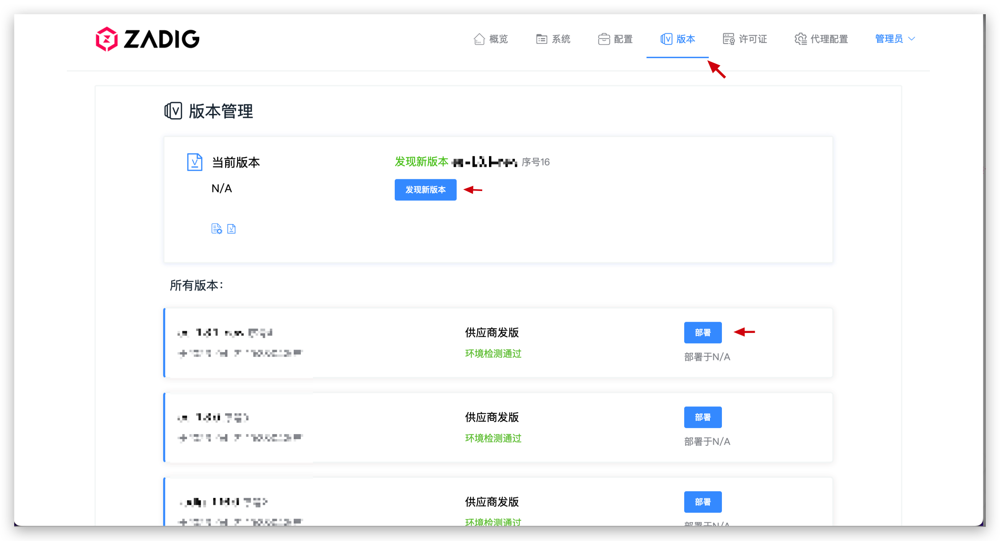

本文主要介绍通过客户交付模块的控制台来安装 ZadigX。

> 如果是试用 ZadigX，推荐使用[官方安装小助手](https://www.koderover.com/trial)来快速安装。

## 第一步：资源准备

- 安装 K8s 集群，版本：<Badge text="v1.16" />~<Badge text="v1.22" />，建议节点 2 台 8C16G，且对该集群有管理员操作权限
- 可正常连通上述 K8s 集群，且安装了 [kubectl](https://kubernetes.io/docs/tasks/tools/) 客户端的机器，用于执行安装命令
- 网络准备：
    - 如果选择 IP+Port 的方式访问 ZadigX 系统，需要确保集群节点有外部 IP 可供访问
    - 如果选择域名方式访问 ZadigX 系统，需要准备可用的域名
- 如果安装高可用 ZadigX，需准备以下数据库资源：
    - 高可用的 MongoDB（版本 >=3.4）
    - 高可用的 MySQL（版本 >=5.7）

::: tip 自建集群注意事项
1. 在安装之前，需要配置 Kubernetes 默认的 StorageClass，以支持创建 PVC 用于数据持久化 
2. 配置 kube-dns 服务，以支持服务和 Pod 之间的按名称寻址
:::

## 第二步：获取安装脚本和安装许可证

联系 [ZadigX 官方](https://www.koderover.com/contacts)获取安装脚本和安装许可证。

## 第三步：安装客户控制台

参考文档：[安装客户控制台](/ZadigX%20v1.4.0/plutus/customer/#安装客户控制台)。

## 第四步：安装 ZadigX

1. 在客户控制台中，点击`发现新版本`获取 ZadigX 的最新版本，点击`部署`进入参数配置页面，正确设置安装参数后部署。

> [点我](#安装参数说明)查看安装参数。

2. 部署完成后，访问 ZadigX 系统，输入许可证，使用管理员账号登录系统即可。

> 管理员账号：admin 管理员密码：默认为 zadig，安装时可指定

## 安装参数说明

### 通用参数

| 参数名 | 必填              | 备注 | 
|--------|-----------------------------|---------|--------|
| global.extensions.extAuth.extauthzServerRef.namespace | 是 | ZadigX 安装所在的 Namespace | 
| endpoint.FQDN |  使用域名访问 ZadigX 时必填 | 访问 ZadigX 系统的完整 URL | 
| endpoint.type | 使用 IP+Port 访问 ZadigX 时必填 | 设置为固定值: IP |
| endpoint.IP | 使用 IP+Port 访问 ZadigX 时必填 | K8s 节点任一可外网访问的 IP |
| gloo.gatewayProxies.gatewayProxy.service.httpNodePort |使用 IP+Port 访问 ZadigX 时必填|指定的端口号 < 30000 - 32767> |
| gloo.gatewayProxies.gatewayProxy.service.type | 使用 IP+Port 访问 ZadigX 时必填 | 固定值:  NodePort|
| dex.config.staticClients[0].redirectURIs[0] | 是 | 使用域名方式访问：`http://${endpoint.FQDN}/api/v1/callback` 使用 IP+Port 方式访问: `http://${IP}:${PORT}/api/v1/callback`|
| init.adminEmail | 默认为 admin@koderover.com| 管理员账号的邮箱 |
| init.adminPassword | 默认为 zadig| 管理员账号的密码 |

### 高可用安装参数

如果安装高可用 ZadigX，还需配置以下参数：

> 高可用版本使用外置的 MongoDB, MySQL 组件，数据持久化以及高可用性由具体的 MongoDb, MySQL 服务提供商保障

| 参数名 | 必填              | 备注 | 
|--------|-----------------------------|---------|--------|
| tags.mysql |是 | 是否安装内置的 MySQL，指定为 false| 
| connections.mysql.host |是 | MySQL 连接地址 |
| connections.mysql.auth.user | 是 | MySQL 用户名 |
| connections.mysql.auth.password | 是| MySQL 密码|
| dex.config.storage.config.host | 是| Dex 系统所使用的 MySQL Host|
| dex.config.storage.config.port|是|Dex 系统所使用的 MySQL 端口|
|dex.config.storage.config.user|是|Dex 系统所使用的 MySQL 用户名|
|dex.config.storage.config.password|是|Dex 系统所使用的 MySQL 密码|
| tags.mongodb | 是 | 是否安装内置的 MongoDB，指定为 false |
| connections.mongodb.connectionString | 是 | MongoDB 数据库连接串，配置多个地址时需要进行转义|
|ee.mongodb.db|必填| MongoDB 数据库名称|
