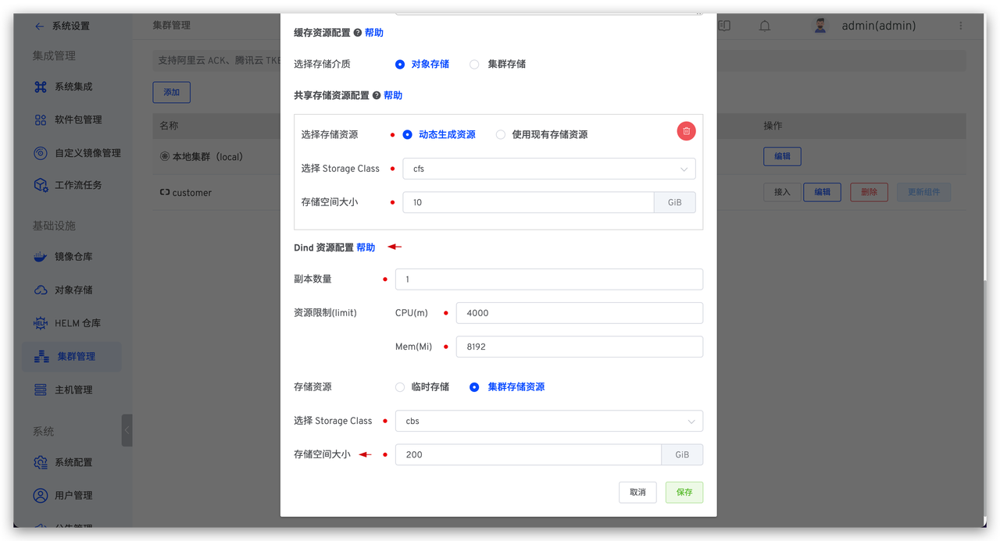
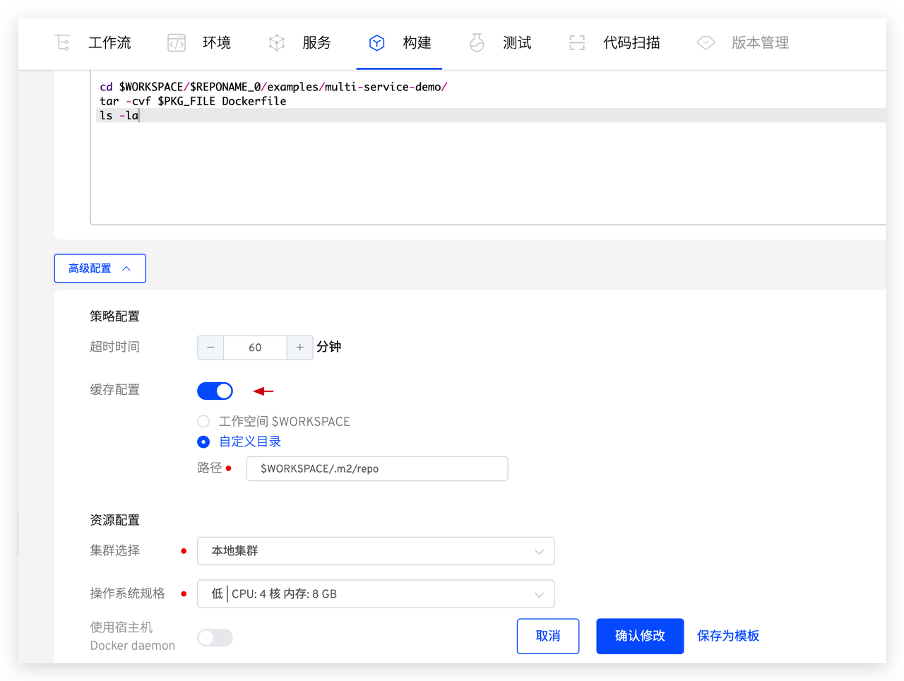
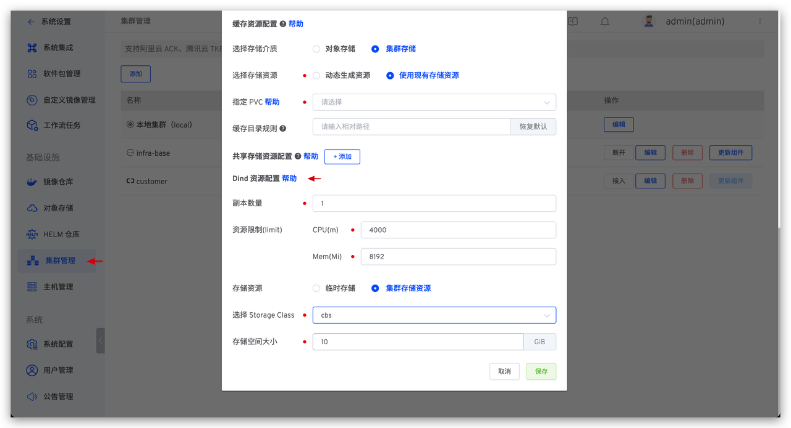
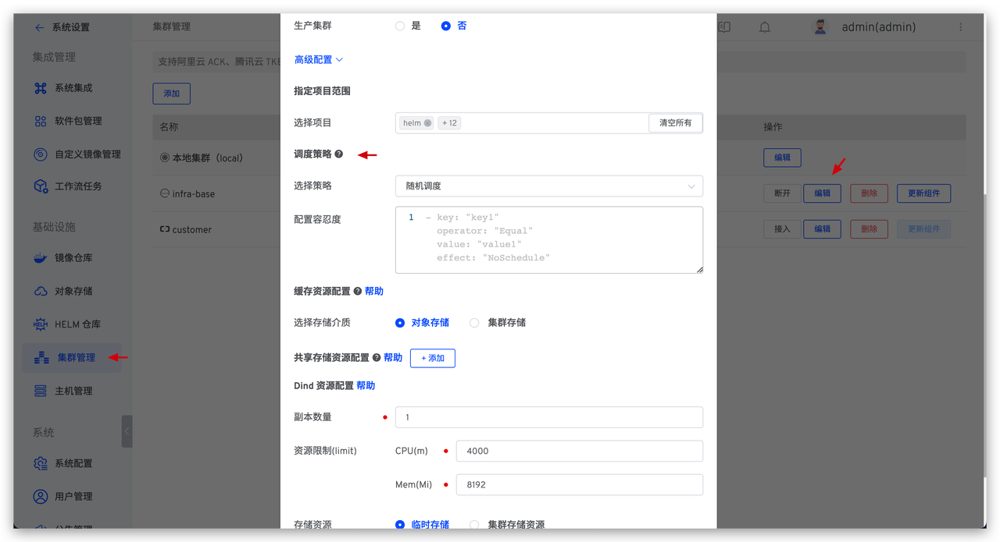
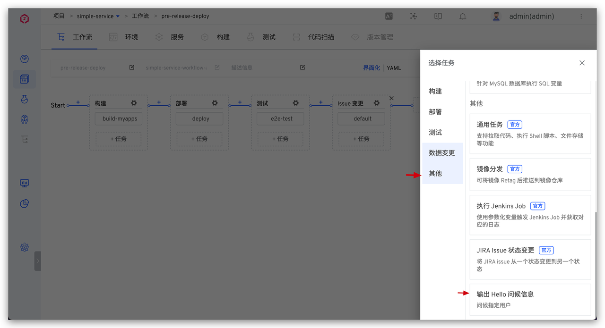

## 概述

本手册是为 ZadigX 管理员（比如：运维团队）所编写，手册中的内容可以帮助你将 ZadigX 的系统功能快速搭建起来（比如：代码源集成、账号系统接入、镜像仓库/对象存储/Helm Chart 仓库/集群管理等）。

## 第三方系统集成

|系统       |  描述                            | 配置方式 |
| ---------- | ---------------------------------| -------|
| 账号系统 | 企业内部统一账号系统接入 |[LDAP](/ZadigX%20v1.4.0/settings/account/ldap/) [OAuth 2.0](/ZadigX%20v1.4.0/settings/account/oauth2/)|
| 代码仓库 | 企业使用的研发代码仓库集成 |[GitLab 集成](/ZadigX%20v1.4.0/settings/codehost/gitlab/) [GitHub 集成](/ZadigX%20v1.4.0/settings/codehost/github/) [Gerrit 集成](/ZadigX%20v1.4.0/settings/codehost/gerrit/) [Gitee 企业版集成](/ZadigX%20v1.4.0/settings/codehost/gitee-enterprise/)|
| 项目管理 | 集成项目管理工具，用于在工作流中自动变更项目管理中的任务状态 |[Jira 集成](/ZadigX%20v1.4.0/settings/jira/) [飞书项目集成](/ZadigX%20v1.4.0/settings/lark/)|
| 配置管理 | 集成配置管理工具，用于在工作流中自动变更业务配置（Apollo 配置/Nacos 配置） |[Apollo 配置](/ZadigX%20v1.4.0/settings/configsystem/apollo/) [Nacos 配置](/ZadigX%20v1.4.0/settings/configsystem/nacos/)|
| 代码扫描 | 集成 Sonar 系统，用于 Sonar 代码扫描 |[Sonar 集成](/ZadigX%20v1.4.0/settings/sonar/)|
| 审批系统 | 集成审批系统，用于工作流流程审批 |[审批系统集成](/ZadigX%20v1.4.0/settings/approval/)|

## 基础设施管理

|系统       |  描述                            | 配置方式 |
| ---------- | ---------------------------------| -------|
| 镜像仓库 | 项目中使用的镜像仓库集成 |[镜像仓库](/ZadigX%20v1.4.0/settings/image-registry/)|
| 对象存储 | 对象存储集成，存放工作流历史日志、测试报告、构建缓存 |[对象存储](/ZadigX%20v1.4.0/settings/object-storage/)|
| Helm Chart 仓库 | 集成 Helm Chart 仓库，用于拉取和推送 Chart 服务 |[Helm 仓库](/ZadigX%20v1.4.0/settings/helm/)|
| 集群管理 | 多集群管理，用于工作流任务执行和服务部署 |[集群管理](/ZadigX%20v1.4.0/pages/cluster_manage/)|

## 进阶使用

### 增加系统可用磁盘空间

当遇到因磁盘空间不足导致工作流执行失败时，需增加 ZadigX 系统所使用的磁盘空间。可以从 **释放磁盘空间** 和 **增加磁盘空间** 两个角度来解决。

1. **释放磁盘空间**：访问系统设置 -> 系统配置 -> 缓存清理 -> 一键清理，快速释放磁盘空间。
::: tip
为避免系统长时间运行产生的缓存资源占用磁盘空间，可设置定时清理，参考文档：[缓存清理](/ZadigX%20v1.4.0/settings/system-settings/#缓存清理)。 
注意：清理镜像缓存后，初次执行工作流构建镜像的效率可能会有影响，请确认无误后再操作。
:::

2. **增加磁盘空间**：访问系统设置 -> 集群管理 -> 编辑集群，修改 Dind 资源配置，调整存储空间大小，参考文档：[Dind 资源配置](/ZadigX%20v1.4.0/pages/cluster_manage/#dind-资源配置)。 

### 工作流构建效率优化

::: tip
从工作流配置和集群资源配置两个角度来优化工作流构建执行效率。以下途径均可提高工作流执行效率：
1. 开启构建缓存，节省构建执行时间
2. 使用更高规格的构建资源
3. 配置工作流并发执行
4. 使用 PVC 资源作为缓存存储介质
5. 使用更高配置的 Dind 资源
:::

1. **开启构建缓存**：访问项目 -> 构建 -> 高级配置，开启缓存配置并自定义缓存目录，可参考文档：[工作流构建缓存](/ZadigX%20v1.4.0/workflow/cache/#工作空间缓存)。

2. **构建资源配置**：访问项目 -> 构建 -> 高级配置，选择更高规格的操作系统配置。

3. **开启工作流并发执行**：系统设置 -> 系统配置中设置任务并发数；编辑工作流 -> 开启并发执行，参考文档：[任务配置](/ZadigX%20v1.4.0/settings/system-settings/#任务配置)，[工作流并发运行](/ZadigX%20v1.4.0/project/workflow/#基本信息)。 

4. **设置集群缓存资源配置**：访问系统设置 -> 集群管理 -> 编辑集群的缓存资源配置，参考文档：[缓存资源配置](/ZadigX%20v1.4.0/pages/cluster_manage/#缓存资源配置)。 

5. **设置集群 Dind 资源配置**：访问系统设置 -> 集群管理 -> 编辑集群的 Dind 资源配置，参考文档：[Dind 资源配置](/ZadigX%20v1.4.0/pages/cluster_manage/#dind-资源配置)。 

### 配置任务的调度资源

> 设置集群的调度策略，将任务调度到指定的节点上运行，确保资源被高效使用。

访问系统设置 -> 集群管理 -> 编辑集群的调度策略，参考文档：[调度策略配置](/ZadigX%20v1.4.0/pages/cluster_manage/#设置调度策略)。

场景一：集群中可用节点都可用于运行任务，选择随机调度。 
场景二：只允许任务在指定的节点上运行，将节点加上专用标签，选择强制调度。 
场景三：集群中可用节点都可用于运行任务，但希望优先使用某些节点，将节点加上标签，选择优先调度。 
场景四：希望实现更细粒度的资源调度，具体设置：给节点增加污点，在调度策略中配置容忍度。 

### 多集群资源管理
> 希望实现细粒度的集群资源管理，比如：不同团队的项目使用不同的集群资源。

访问系统设置 -> 集群管理 -> 添加集群。参考文档：[集群管理](/ZadigX%20v1.4.0/pages/cluster_manage/)。 
对于不同的网络情况，使用不同的方式来接入集群：
1. 外接集群可以访问 ZadigX 所在的集群，使用代理连接的方式接入。
2. ZadigX 所在的集群可以访问外接集群，使用直接连接的方式接入。

### 配置科学上网
> 适用于有额外的网络需求（比如：代码构建中存在外部依赖；拉 GitHub 代码超时等）。

访问系统设置 -> 系统配置 -> 添加代理配置，参考文档：[代理配置](/ZadigX%20v1.4.0/settings/system-settings/#代理配置)。

### 从 0 到 1 实现自定义任务

> 前期准备工作：编码实现自定义任务的功能，提交到代码库。自定义任务的实现对文件目录结构有要求，参考文档：[自定义任务](/ZadigX%20v1.4.0/settings/custom-task/#实现自定义任务)；

1. 访问 ZadigX 的系统设置 -> 工作流任务，添加来源。

2. 在自定义工作流中添加任务，配置自定义任务。参考文档：[自定义工作流](/ZadigX%20v1.4.0/project/common-workflow/#基本概念)。

