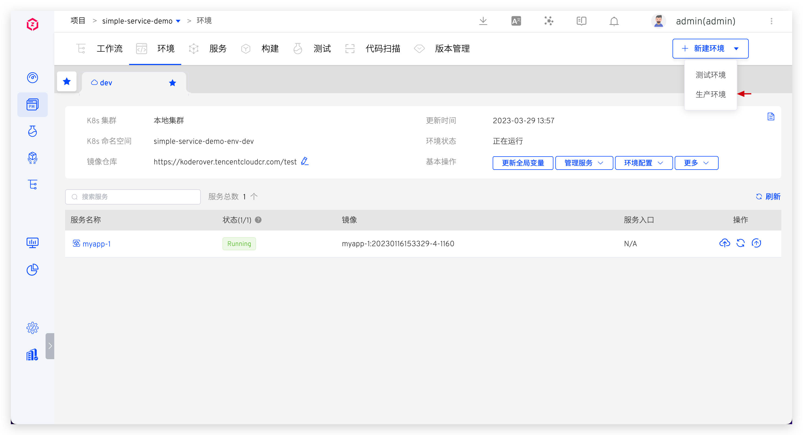
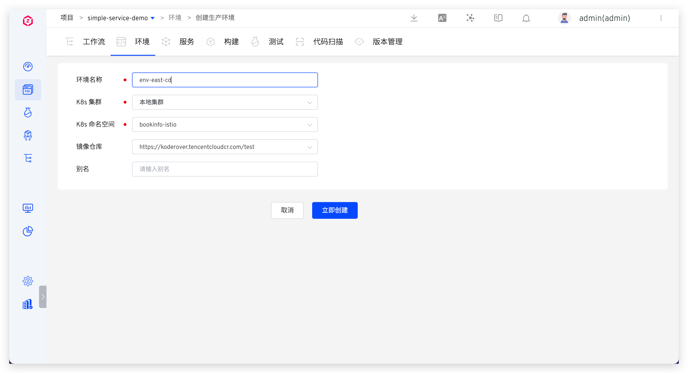
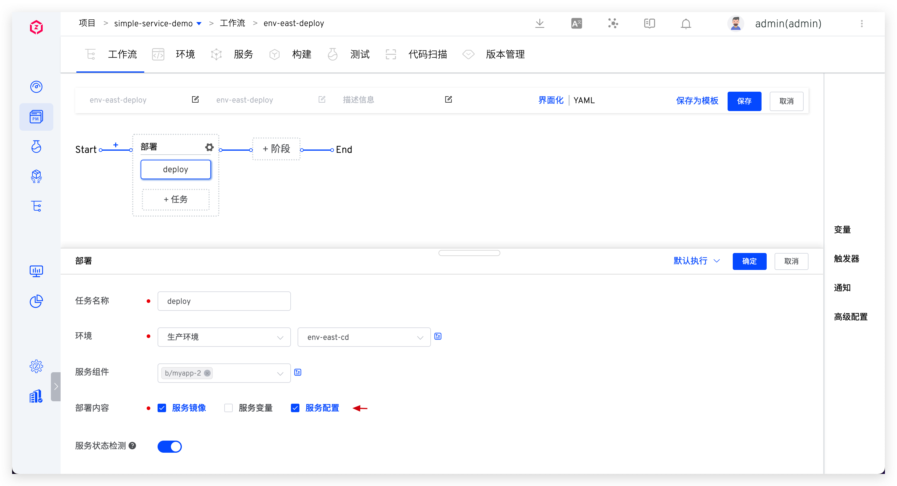
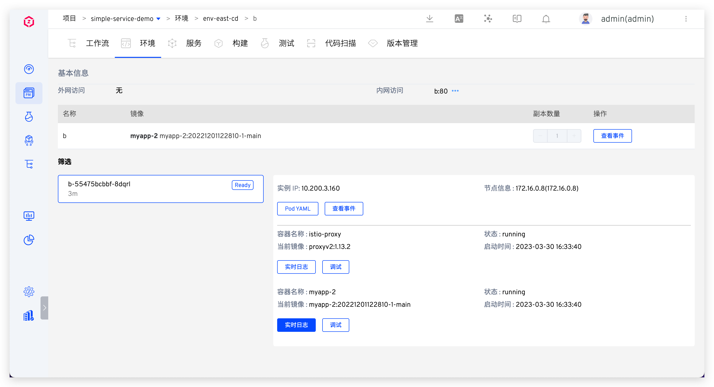
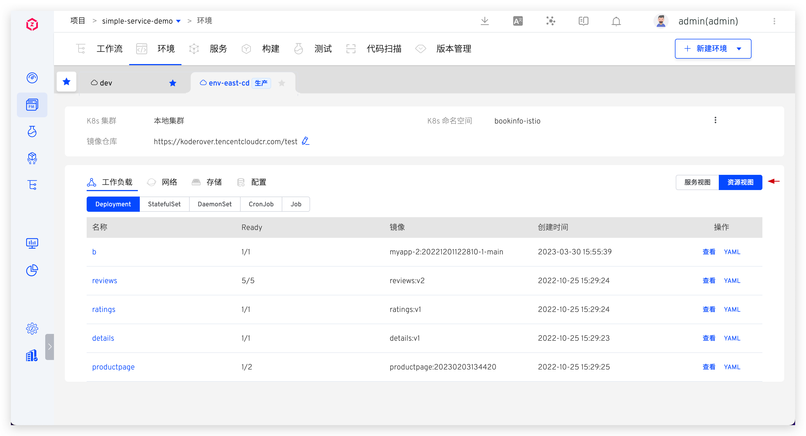

> 生产环境为功能。

## 创建环境

在 K8s YAML 项目中，点击`创建环境`按钮，选择生产环境。

参数说明：

- `环境名称`：要创建的环境的名称，比如：`env-shanghai-ap1`、`env-shanghai-ap2`。
- `K8s 集群`：选择创建环境时所使用的集群资源，其中`本地集群`指 ZadigX 系统所在的集群。关于集群的集成可参考[集群管理](/ZadigX%20v1.4.0/pages/cluster_manage/)。
- `K8s 命名空间`：选择环境所使用的 K8s 命名空间，后续服务将会被部署在该命名空间中
- `镜像仓库`：选择环境所使用的镜像仓库，后续使用工作流部署更新服务时，将会从该镜像仓库拉取镜像
- `别名`：非必填，用户可根据自身需要设置别名。

生产环境创建完毕后，即可使用自定义工作流将生产服务部署到环境中，参考[部署更新服务](#部署更新服务)。

## 部署更新服务
> 前提：生产服务的配置已经在 `项目` - `服务` - `生产服务` 中管理，参考：[生产服务](/ZadigX%20v1.4.0/project/service/k8s/prod/)。

使用 ZadigX 的自定义工作流能力将生产服务部署更新到生产环境中，简单示例如下：
1. 配置自定义工作流，增加部署任务，指定生产环境、生产服务对应的服务组件、部署内容选择`服务镜像`和`服务配置`。
> 关于自定义工作流的更多使用姿势可参考：[自定义工作流](/ZadigX%20v1.4.0/project/common-workflow/)。

2. 执行上述自定义工作流，待工作流成功执行完毕后，服务即部署成功。
    - 第一次执行时请勾选`使用最新变更`，确保将服务部署到生产环境中
    - 后续若希望更新服务的镜像版本/YAML 配置文件，在执行工作流时按需选择服务镜像及服务配置后即可

## 查看环境

点击不同的环境 Tab 即可切换到该环境的详情页面，点击`服务视图`即可查看该环境下的所有服务。

点击服务名称可查看服务实例详情，查看其实时日志，登录到服务容器中进行调试等。

点击`资源视图`，可从工作负载/网络/存储/配置等资源视角对该环境所在命名空间下的资源进行查看。

