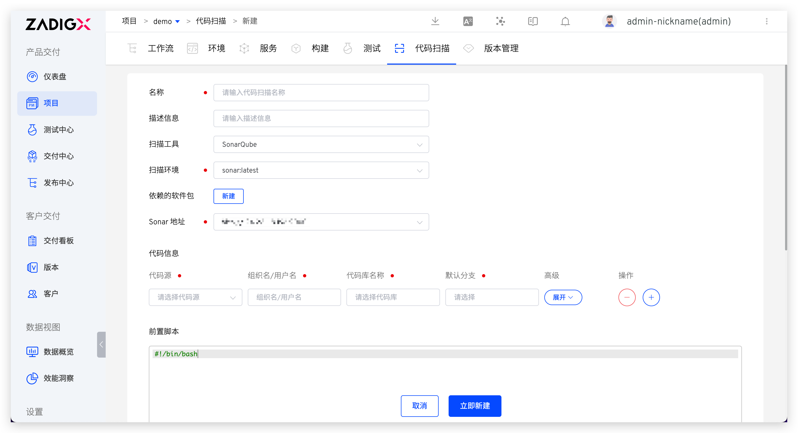
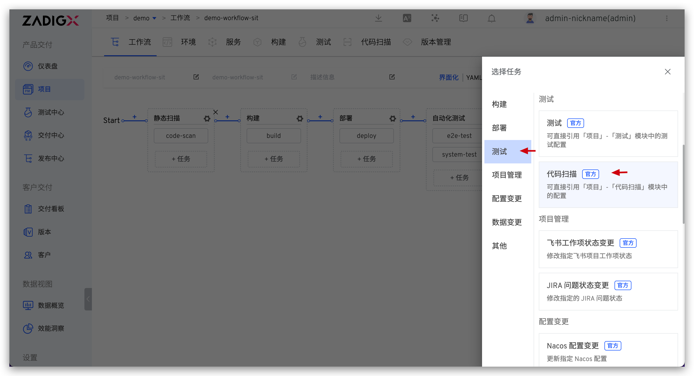
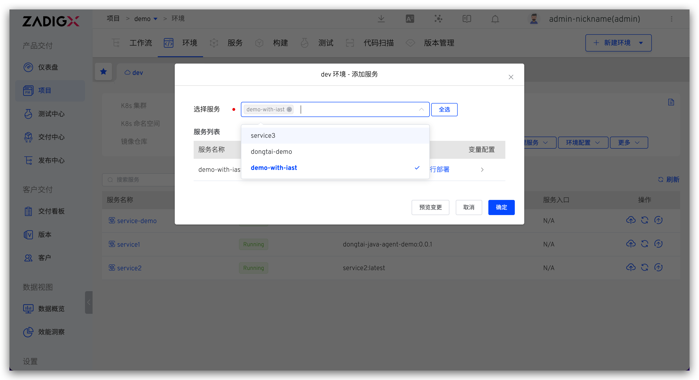
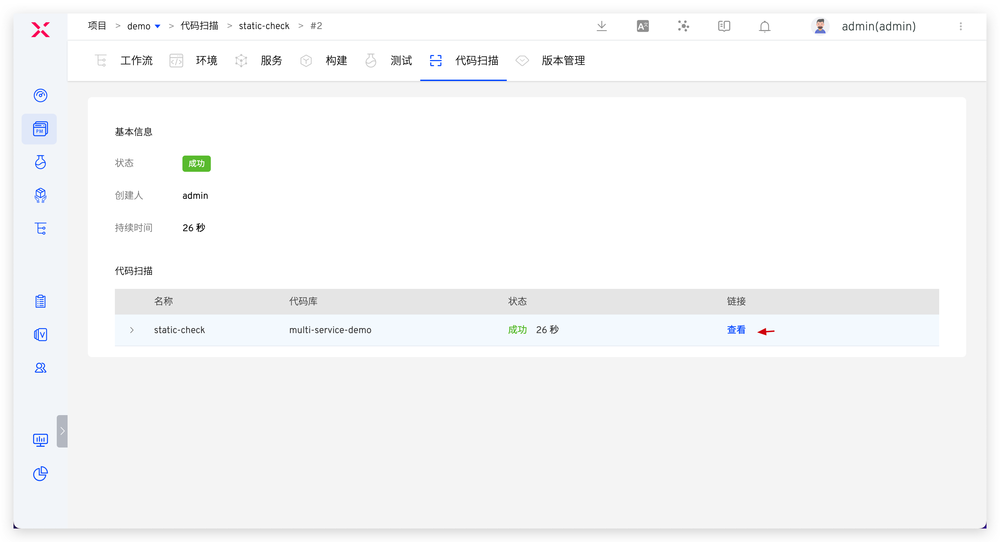
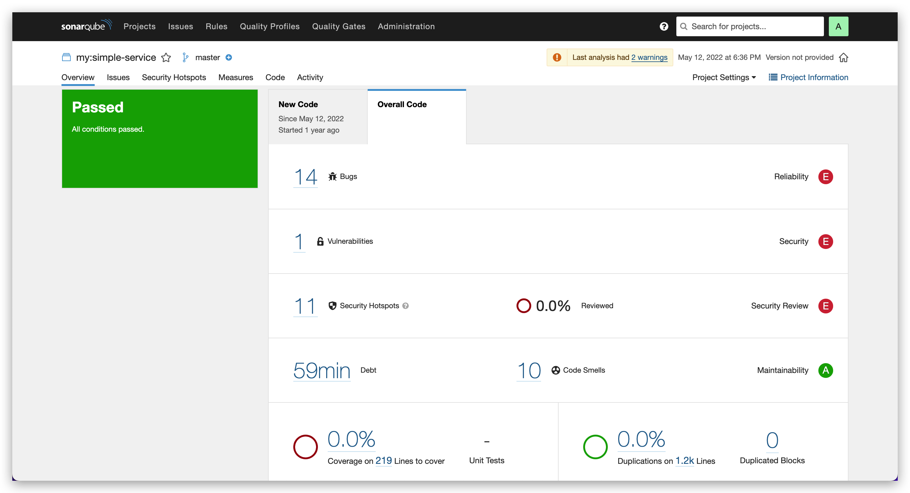
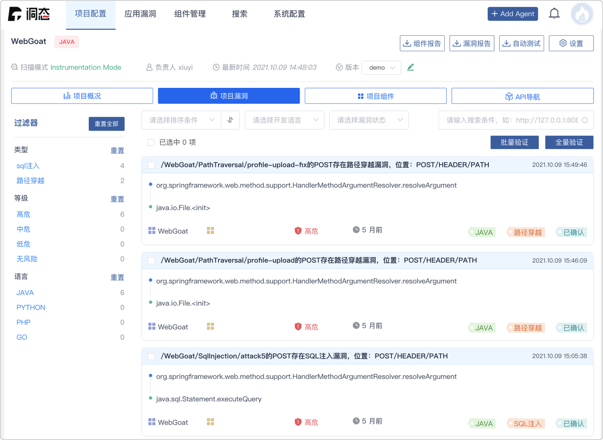

## 概述

ZadigX 具备管理软件开发全生命周期的能力，几乎支持市面上所有的安全工具和服务。ZadigX 可以很方便的将这些工具（产品）编排到整个交付链路中，借助强大的运行时环境和自定义工作流能力，为安全团队提供强有力的支持。<br>
ZadigX 帮助安全团队将安全服务和能力向左移动到开发人员和运维团队，尽早发现安全问题，使其他角色也参与解决安全性和合规性问题，从而避免因修复此类问题而造成额外成本。

## 安全服务接入

### 静态安全 SAST

**第一步：配置代码扫描**

新增代码扫描，填写代码扫描配置，参考文档：[代码扫描](/ZadigX%20v1.5.0/project/scan/)。

::: tip
对于 SonarQube 工具，可开启质量门禁检查，参考文档：[质量门禁检查](/ZadigX%20v1.5.0/project/scan/#质量门禁检查)。
:::



**第二步：在工作流中编排代码扫描**

编辑工作流，按需在指定阶段（比如：构建任务之前）添加代码扫描任务，参考文档：[配置工作流](/ZadigX%20v1.5.0/project/common-workflow/)。



### 软件成分分析 SCA
coming soon...

### 动态应用安全测试 IAST

**第一步：将 IAST 能力集成到服务中**

以 DongTai 进行示例，修改服务的 YAML 配置内容，安装 DongTai IAST Agent，并修改服务启动命令。服务 YAML 样例如下：

::: tip
可以在服务的 YAML 配置内容中灵活使用 ZadigX 的服务变量能力，按需控制是否需要为服务安装 Agent 进行动态安全检测，参考文档：[服务变量](/ZadigX%20v1.5.0/project/service/k8s/#变量配置)。
:::

``` yaml
// 服务原始配置内容
apiVersion: apps/v1
kind: Deployment
metadata:
  labels:
    app: service1
  name: service1
spec:
  selector:
    matchLabels:
      app: service1
  template:
    metadata:
      labels:
        app: service1
    spec:
      containers:
        - name: service1
          image: dongtai/dongtai-java-agent-demo:0.0.1
```
``` yaml
// 安装 DongTai IAST Agent 后的服务配置内容
apiVersion: apps/v1
kind: Deployment
metadata:
  labels:
    app: service1
  name: service1
spec:
  selector:
    matchLabels:
      app: service1
  template:
    metadata:
      labels:
        app: service1
    spec:
      {{- if .iast }}
      volumes:
        - name: dongtai-iast-agent
          emptyDir: {}
      initContainers:
        - name: agent-init-container
          image: curlimages/curl
          volumeMounts:
            - name: dongtai-iast-agent
              mountPath: /tmp
          args:
            - "-k"
            - "-X"
            - "GET"
            - "从洞态管理后台获取到的 Agent 下载请求地址"
            - "-H"
            - "从洞态管理后台获取到的 Agent 下载请求的 Header 信息"
            - "-o"
            - "/tmp/agent.jar"
      {{- end}}
      containers:
        - name: service1
          image: dongtai/dongtai-java-agent-demo:0.0.1
          {{- if .iast }}
          volumeMounts:
            - name: dongtai-iast-agent
              mountPath: /agent
          env:
            - name: JAVA_TOOL_OPTIONS
              value: "-javaagent:/agent/agent.jar"
          {{- end}}
```

**第二步：将服务部署到环境中**

将注入 IAST Agent 的服务部署到环境中，参考文档：[添加服务](/ZadigX%20v1.5.0/project/env/k8s/#添加服务)。



## DevSecOps 核心用户场景介绍

### 开发阶段静态安全注入

> 流程包含：代码提交 > 静态扫描 > 构建 > 部署> 自测联调

代码实现完毕提交代码变更 PR 后，会自动触发静态代码扫描执行。扫描结果会反馈在 PR 中，点击可跳转 ZadigX 查看失败原因，在开发源头有效规避代码中的质量隐患、安全隐患。


对于使用 SonarQube 工具的代码扫描，点击链接可跳转 Sonar 系统分析代码扫描的更多结果，有针对性的修复，修复完毕后执行 dev 工作流进行日常自测联调。




### 测试阶段组合安全策略

> 流程包含：静态扫描（开启质量门禁） > 构建 > 部署 > 自动化测试（业务测试 + 动态安全检测）

研发提测后，测试工程师基于代码分支 + PR 执行工作流，部署集成测试验证环境并对环境做自动化测试。工作流执行后会自动通知到 IM 中。登录管理后台可查看动态安全检测漏洞详情，推进团队及时修复，尽早规避安全风险。




如果静态扫描任务执行失败，将会阻止后续的构建和部署任务运行。未通过验收的代码变更将被拒绝合并，以便从源代码层面捕获安全隐患，并建立有效的质量门禁措施。这种做法可以防止潜在问题进入到系统中。


### 发布阶段全巡检审批

> 流程包含：安全委员会审核 > 分批次灰度发布 > 自动化测试

当测试验收通过后，执行 prod 工作流执行生产发布，审批通过后方可发布，建议几种配置策略：
1. 建设发布门禁，通过自定义任务自动获取安全扫描、单元测试、回归测试等质量结果来判断是否允许上线，作为上线过程的卡点，确保版本验收通过并且符合企业安全要求后再做上线操作。
2. 灵活编排蓝绿、金丝雀、分批次灰度、Istio 等发布策略，以确保发布可靠性，可参考：[发布工作流](/ZadigX%20v1.5.0/project/release-workflow/)。
3. 发布工作流增加安全团队人工审批，以确保业务流程上的发布合规性。


