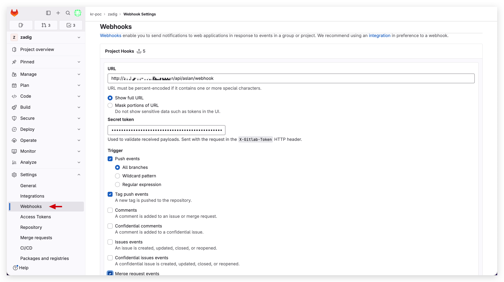
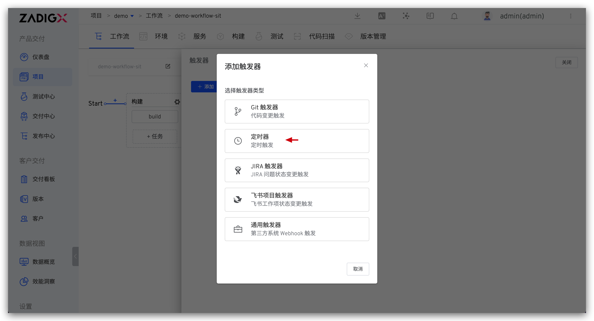
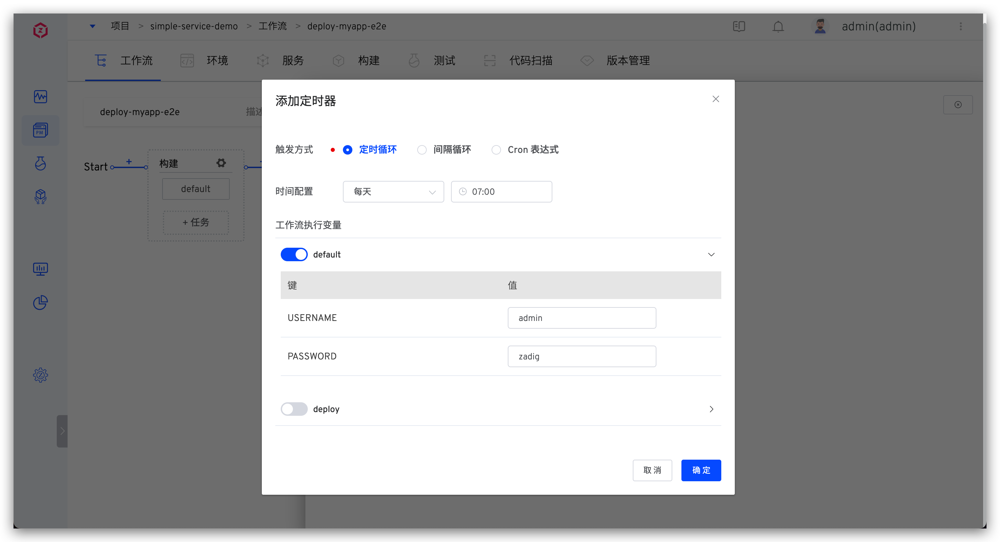
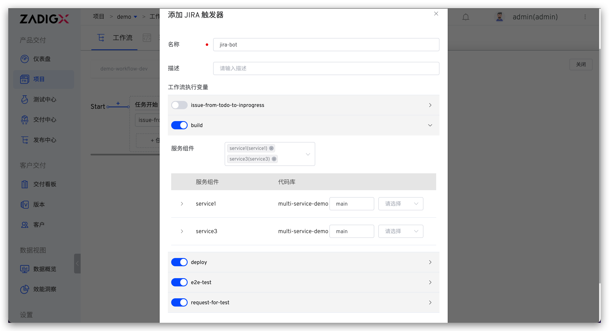
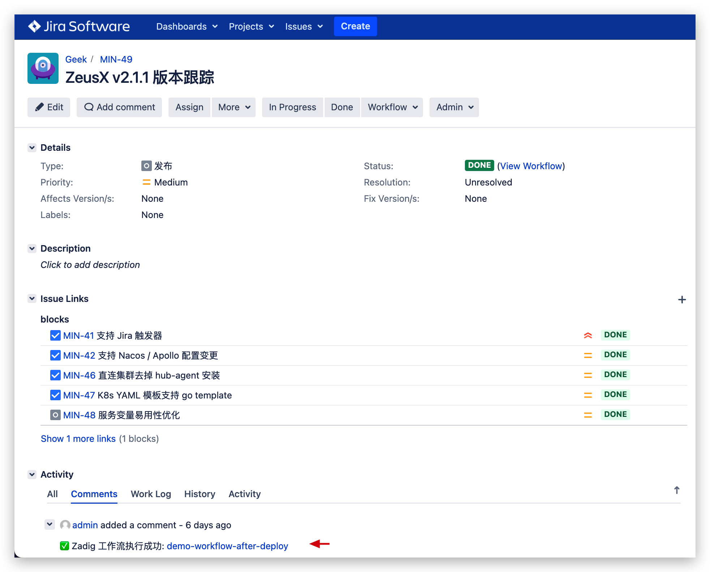
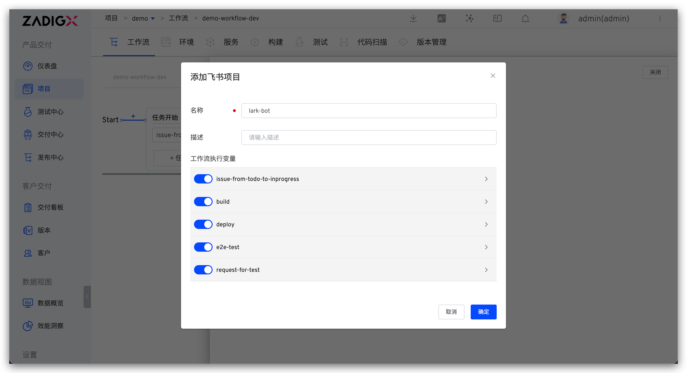
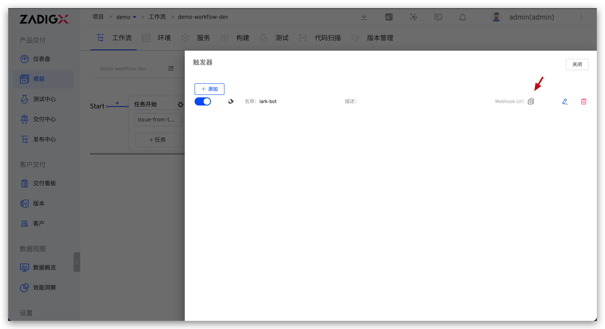
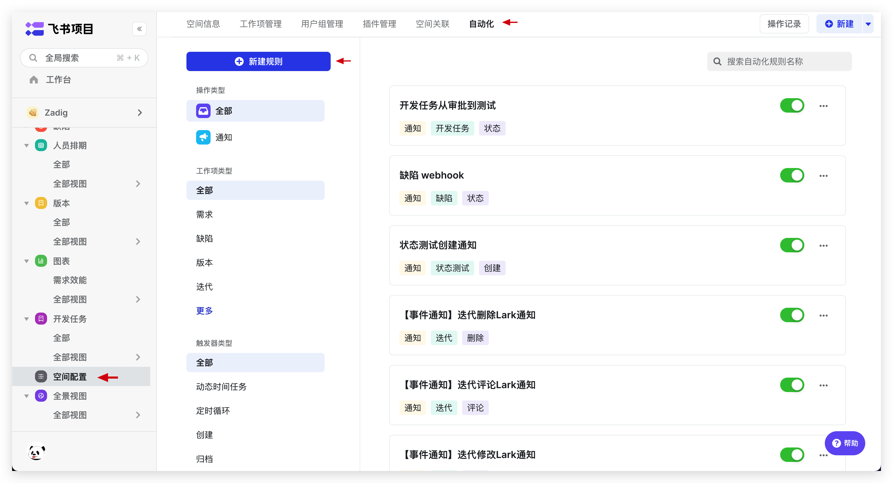

## 简介

本文主要介绍自定义工作流/发布工作流的触发器功能，包括：

- `Git 触发器`：代码变更后自动触发工作流
- `定时器`：定时触发工作流
- `JIRA 触发器`：JIRA 问题状态变更后自动触发工作流
- `飞书项目触发器`：飞书项目状态变更后自动触发工作流
- `通用触发器`：任意第三方系统通过 Webhook 自动触发工作流

产品工作流中支持 Git 触发器和定时器，具体使用可参考文档：[产品工作流触发器操作](/ZadigX%20v1.6.0/project/workflow/#git-webhook)、[产品工作流定时器操作](/ZadigX%20v1.6.0/project/workflow/#定时器)。

## Git 触发器

::: tip
1. 为工作流配置触发器，当满足触发条件的事件发生时会自动触发工作流执行。
3. 支持的代码源请参考文档：[代码源信息](/ZadigX%20v1.6.0/settings/codehost/overview/#功能兼容列表)。
:::

点击工作流右侧的 `触发器` -> 选择 `Git 触发器`即可配置，支持自动创建和手动创建两种方式，实现代码变更自动触发工作流。

### 自动创建

参数说明：
- `工作流执行变量`：希望被 Webhook 触发执行的任务，以及任务中的具体配置
- 其他参数：请参考 [Git 触发器基本配置](/ZadigX%20v1.6.0/project/workflow/#自动创建)中的描述

### 手动创建

第一步：点击`手动创建 Webhook` 切换到手动创建页面。

第二步：配置代码库中的 Webhook，填写 Webhook URL、Secret Token、触发事件后保存。以 GitLab 示例如下：

::: tip 不同代码源中的触发事件
- GitHub 代码源：Branch or tag creation、Check runs、Pull requests、Pushes
- GitLab 代码源：Push events、Tag push events、Merge request events
- Gitee 代码源：Push、Tag Push、Pull Request
:::

第三步：填写 Zadig 中的相关配置后保存即可，参考文档：[Git 触发器基本配置](/ZadigX%20v1.6.0/project/workflow/#自动创建)。

## 定时器

编辑工作流，点击右侧的 `触发器` -> 选择 `定时器`，通过配置定时器，可以实现周期性的运行工作流。支持定时循环、周期循环以及基于 Cron 表达式循环。

参数说明：

- 工作流执行变量：希望被触发执行的任务，以及任务中的具体配置
- 其他参数：参考[定时器配置](/ZadigX%20v1.6.0/project/workflow/#定时器)

## JIRA 触发器

可实现 JIRA 状态变更后自动触发 ZadigX 工作流。

### 第一步：在工作流中添加 JIRA 触发器

编辑工作流，点击右侧的 `触发器` -> 选择 `JIRA 触发器`。

填写参数后保存触发器配置。

参数说明：
- `工作流执行变量`：希望被触发执行的任务，以及任务中的具体配置

复制 Webhook Url 后保存工作流。

### 第二步：在 JIRA 中完成 Webhook 配置

访问 JIRA 系统 -> 点击右上角的 `设置` 图标 -> 点击 `System` -> 在左侧 `ADVANCED` 下找到 `Webhook`。

点击 `+ Create a Webhook` -> 填写 URL（即：第一步中保存的 Webhook Url）并配置触发事件。

::: tip 提示
目前支持基于 `Issue related events` 事件自动触发工作流
:::

当满足条件的事件发生后会自动触发工作流执行，待工作流执行完成后，将会添加 Comment 到对应的 Issue 中。

## 飞书项目触发器

可实现飞书工作项状态变更后自动触发 ZadigX 工作流。

### 第一步：在工作流中添加飞书项目触发器

编辑工作流，点击右侧的`触发器` -> 选择 `飞书项目触发器`。

填写参数后保存触发器配置。

参数说明：
- `工作流执行变量`：希望被触发执行的任务，以及任务中的具体配置

复制 Webhook Url 后保存工作流。

### 第二步: 在飞书项目中完成 Webhook 配置

点击 `空间配置` -> `自动化` -> `新建规则`，进入规则创建。

根据需要选择规则，并在操作中将`操作类型`设为 WebHook -> 填写 URL（即：第一步中保存的 Webhook Url）后保存规则。

当满足条件的事件发生后会自动触发工作流执行，待工作流执行完成后，将会添加 Comment 到对应的 Issue 中。

## 通用触发器
点击右侧的 `触发器` -> 选择 `通用触发器` 即可配置实现第三方 Webhook 触发工作流。

参数说明：
- `工作流执行变量`：希望被触发执行的任务，以及任务中的具体配置

复制 Webhook Url，在第三方系统中完成添加。

