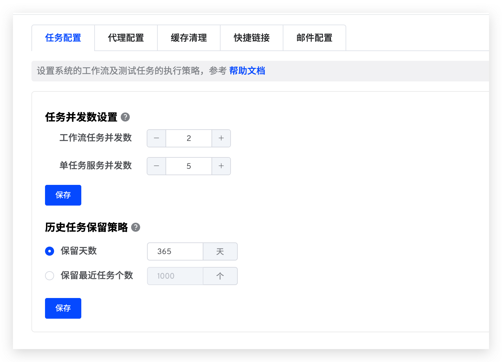
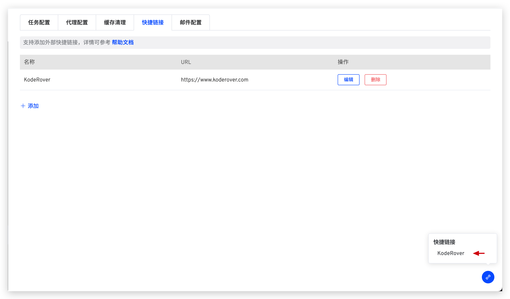
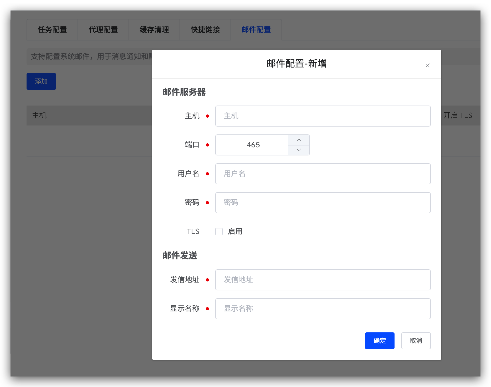

本文介绍 Zadig 系统配置的一些基本功能。包括：任务配置、代理配置、缓存清理、快捷链接、邮件配置。

## 任务配置

### 任务并发数设置
- 工作流任务并发数：控制工作流/测试任务的并发数。
- 单任务服务并发数：控制工作流任务执行时，同时部署更新的服务数量。

### 历史任务保留策略

::: danger
谨慎操作，清除的数据不可恢复
:::
Zadig 支持用户设置工作流数据（包括工作流任务及其产生的构建日志、二进制文件、测试日志、测试报告）保存时长，默认保留 365 天，超过时限的数据将被永久清除。

## 代理配置

- Zadig 系统支持代理的使用，配置如下图所示。

::: warning
只配置代理，不在具体模块开启代理，代理不会生效
:::

- 目前，在执行构建任务时可以使用代理。具体设置如下：
1. 拉取代码时走代理，需要在`系统设置` -> `集成管理` -> `代码源集成` 中开启
2. 拉取安装软件包走代理，需要在`系统设置` -> `软件包管理` 中开启

## 缓存清理
清理系统中的组件缓存，包括停止的容器、所有未被容器使用的网络、无用的镜像和`构建缓存镜像`：

## 快捷链接
在系统配置中添加常用外部链接，方便用户快捷访问。

## 邮件配置

系统管理员访问 `系统设置` -> `系统配置` -> `邮件配置`，点击`添加`定义邮件配置。

主机信息参数说明：
- `主机`：发送邮件服务器地址，比如：`smtp.example.163.com`
- `端口`：发送邮件服务器端口号，默认为 `465`
- `用户名`：邮箱客户端用户名，可咨询邮箱服务商
- `密码`：邮箱客户端密码，可咨询邮箱服务商
- `TLS`：是否开启 TLS 安全协议

发信设置参数说明：
- `发信地址`：发送邮件的邮箱地址，比如：`no-reply@koderover.com`
- `显示名称`：发送地址中的邮箱在邮件中显示的名称，比如：`no-reply`