本文主要介绍 K8s YAML 项目、K8s Helm Chart 项目中的环境相关操作。
<!--
本文主要介绍 K8s YAML 项目、Helm Chart 项目、主机项目及托管 Kubernetes 项目中的环境相关操作。
-->

## K8s YAML 环境

### 创建环境
在项目中，点击`创建环境`按钮进入创建环境页面。

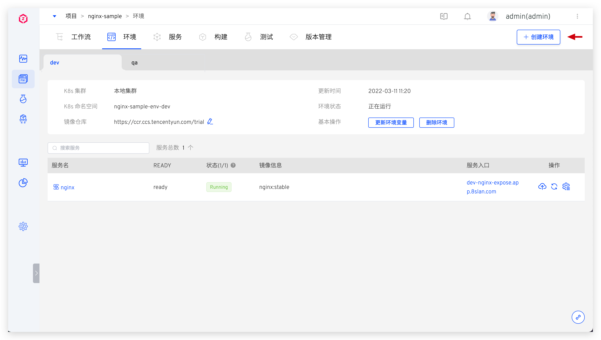
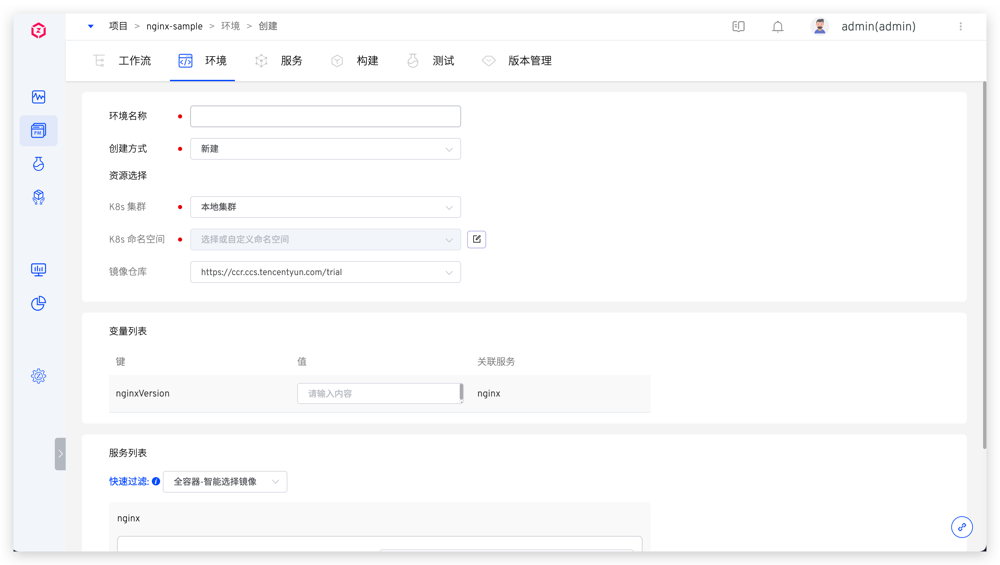

#### 基本信息

- `环境名称`：要创建的环境的名称，比如：`dev`、`pre-release`。
- `资源选择`：
	- `K8s 集群`：选择创建环境时所使用的集群资源，其中`本地集群`指 Zadig 系统所在的集群。关于集群的集成可参考[集群管理](/v1.10.0/pages/cluster_manage/)。
	- `K8s 命名空间`：不同的环境会使用独立的 Kubernetes 命名空间实现隔离。Zadig 系统创建命名空间的默认规则为 `项目名-env-环境名`，用户也可以自定义或者选择已有命名空间。
	- `镜像仓库`：指定环境创建后所使用的镜像仓库，使用工作流构建部署服务，以及修改服务镜像，均会使用此处指定的镜像仓库。关于镜像仓库的集成可参考[镜像仓库管理](/v1.10.0/settings/image-registry/#添加镜像仓库)。

#### 变量列表

> 此处的变量列表包括服务配置中的[自定义变量](/v1.10.0/project/service/#变量配置)，创建服务时可以按需设置其默认值。

在创建环境时可以按需对默认值做覆盖，实现对不同环境的服务进行差异化配置。

#### 服务列表

该部分可以让用户自定义服务所使用的镜像，与此同时，平台提供 2 个快捷选项：

- `全容器-智能选择镜像`：给每个容器自动选择镜像仓库中最新的镜像版本。
- `全容器-全部默认镜像`：给每个容器选择服务 YAML 中配置的镜像版本。

#### 开始创建
输入环境名称等必要信息后，点击`立即创建`按钮即可开始创建环境。

::: tip
服务数量以及启动服务所需的资源会影响环境的创建时间，请耐心等待。
:::

### 查看环境

环境创建完成后，点击不同的环境 Tab 即可切换到该环境的详情页面。

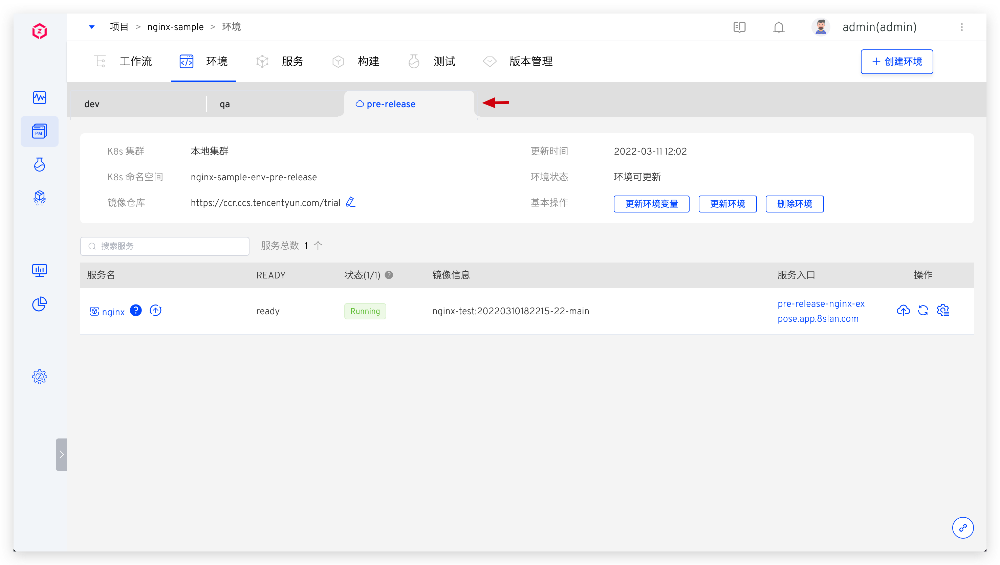

#### 基本信息
基本信息包括 K8s 集群，K8s 命名空间，更新时间，环境状态，镜像仓库。

环境状态有以下几种情况：
- `创建中`：正在创建。
- `更新中`：正在更新。
- `删除中`：正在删除。
- `正在运行`：环境中所有服务都是正常的 Running 状态。
- `运行不稳定`：环境中一部分服务处于 Unstable 状态，可能的情况有两种：
	- 容器服务出现了问题.
	- 容器服务正在进行更新操作，例如更新镜像，会出现短时间的服务 Unstable，当更新过程完成之后，服务状态会恢复为 Running。
- `环境可更新`：当已创建的环境对应的环境模板有更新之后，环境处于可更新状态，有读写权限的用户可以看到`更新环境`按钮，点击按钮可对环境进行模板和配置的更新。

#### 基本操作

环境操作包括：

- `更新环境变量`：对环境中的引用变量进行更新。
- `更新环境`：当环境对应的服务编排有变更或环境里面的服务 YAML 有变更时，环境中会自动出现更新环境按钮。。
- `删除环境`：删除当前环境，环境删除后不可恢复。

#### 查看服务详情

在服务列表中点击具体的服务可查看该服务的更多信息，具体请阅读[服务详情](#服务详情)。

### 更新环境

当环境可更新时，点击基本操作中的`更新环境`即可对环境进行更新。

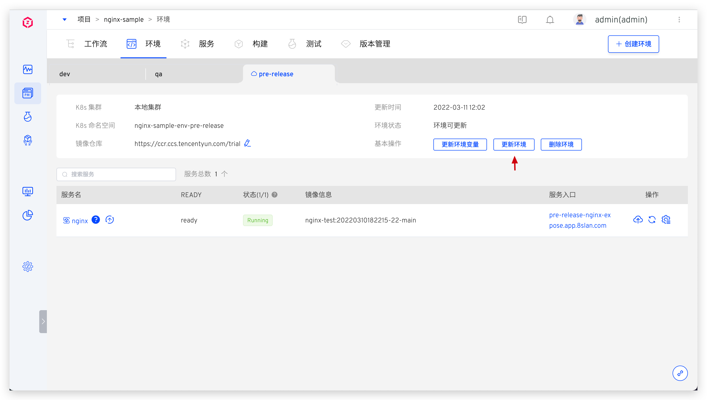

::: tip
当系统检测到当前项目下的服务和环境中不一致时，该环境即会处于可更新状态。导致不一致的原因包括但不限于：
1. 服务配置发生变化。
2. 服务编排发生变化，比如服务从项目中删除，或者给项目新加了服务。
:::

### 删除环境

点击基本操作中的`删除环境`按钮并输入环境名即可删除环境。

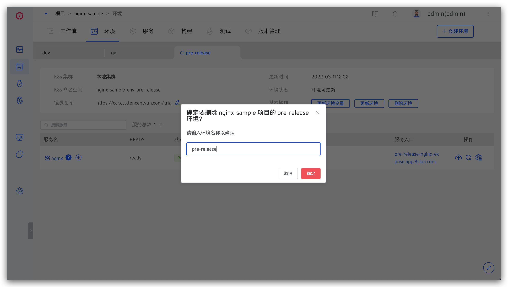

## Helm Chart 环境
### 创建环境

在项目中，点击`创建环境`按钮进入创建环境页面。

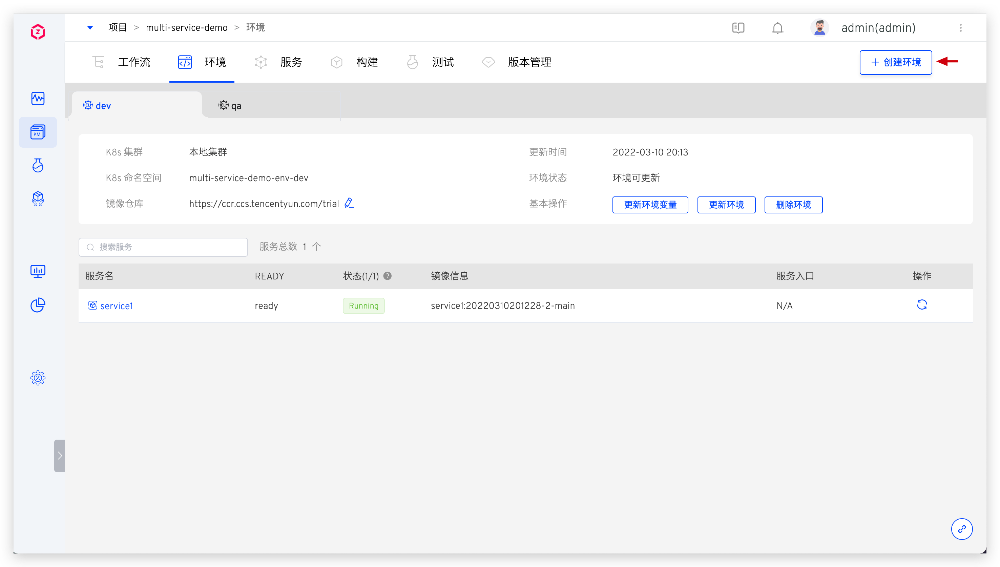

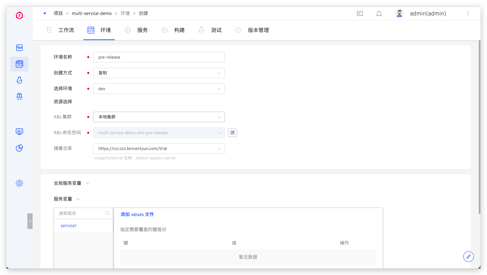

#### 基本信息
- `环境名称`：要创建的环境的名称，比如：`dev`、`pre-release`。
- `创建方式`：包括`新建`和`复制`。
	- `新建`：基于服务的 Chart 配置，创建全新的环境。
	- `复制`：基于在 Zadig 中已有的环境复制一份新的环境出来。
- `选择环境`：当创建方式是`复制`时需要配置该项，用于选择要复制的环境。
- `资源选择`：
	- `K8s 集群`：选择创建环境时所使用的集群资源，其中`本地集群`指 Zadig 系统所在的集群。关于集群的集成可参考[集群管理](/v1.10.0/pages/cluster_manage/)。
	- `K8s 命名空间`：不同的环境会使用独立的 Kubernetes 命名空间实现隔离。Zadig 系统创建命名空间的默认规则为 `项目名-env-环境名`，用户也可以自定义或者选择已有命名空间。
	- `镜像仓库`：指定环境创建后所使用的镜像仓库，使用工作流构建部署服务，以及修改服务镜像，均会使用此处指定的镜像仓库。关于镜像仓库的集成可参考[镜像仓库管理](/v1.10.0/settings/image-registry/#添加镜像仓库)。

#### 全局服务变量
点击展开`全局服务变量`，可修改 values 文件内容设置环境级别的变量值，系统支持 2 种方式设置全局服务变量：

- 手动输入 YAML 格式文件的内容，内容详情即为要设置的变量信息。
- 从指定代码库同步 values。

#### 服务变量

可选择修改指定服务的 values 文件内容配置服务级别的变量值，系统支持 3 种方式修改服务变量：
- 手动输入 values 文件内容。
- 从指定代码库同步 values 文件。
- 手动输入 key/value 键值对，覆盖在创建 Helm Chart 服务时导入的 values 文件内容。

::: tip 扩展知识
1. 服务变量的设置只对单一服务生效。
2. 全局服务变量的设置对当前环境的所有服务都生效。
2. 如果既设置了全局服务变量，又设置了服务变量时，服务变量的优先级高于全局服务变量。
:::

#### 开始创建
输入环境名称，按需设置服务变量等信息后，点击`立即创建`按钮即可开始创建环境。

::: tip
服务数量以及启动服务所需的资源会影响环境的创建时间，请耐心等待。
:::

### 查看环境
环境创建完成后，点击不同的环境 Tab 即可切换到该环境的详情页面。

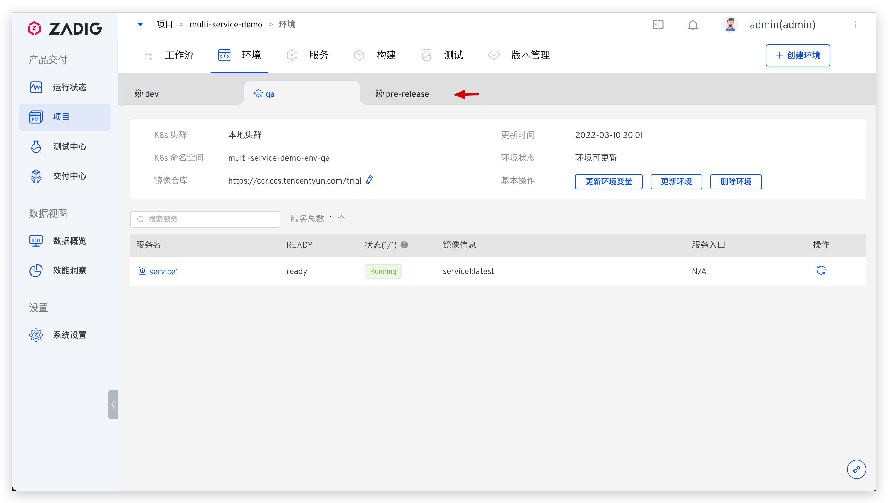

#### 基本信息
基本信息包括 K8s 集群，K8s 命名空间，更新时间，环境状态，镜像仓库。

环境状态有以下几种情况：
- `创建中`：正在创建。
- `更新中`：正在更新。
- `删除中`：正在删除。
- `正在运行`：环境中所有服务都是正常的 Running 状态。
- `运行不稳定`：环境中一部分服务处于 Unstable 状态，可能的情况有两种：
	- 容器服务出现了问题。
	- 容器服务正在进行更新操作，例如更新镜像，会出现短时间的服务 Unstable，当更新过程完成之后，服务状态会恢复为 Running。
- `环境可更新`：当已创建的环境对应的环境模板有更新之后，环境处于可更新状态，有读写权限的用户可以看到`更新环境`按钮，点击按钮可对环境进行模板和配置的更新。

#### 基本操作

环境操作包括：

- `更新环境变量`：包括更新全局服务变量和服务变量。
- `更新环境`：当前项目-服务中的 Helm Chart 有增/删/内容变更时，环境中会自动出现更新环境按钮。
- `删除环境`：删除当前创建的环境，环境删除后不可恢复。

#### 查看服务详情

在服务列表中点击具体的服务可查看该服务的更多信息，具体请阅读[服务详情](#服务详情)。

### 更新环境
当环境可更新时，点击基本操作中的`更新环境`即可对环境进行更新。

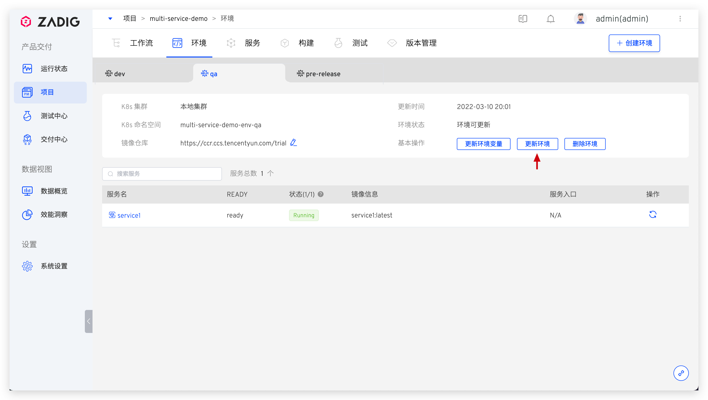

### 删除环境
点击基本操作中的`删除环境`按钮并输入环境名即可删除环境。

## K8s 托管环境
### 创建环境
在 K8s 托管项目中点击`创建环境`按钮进入创建环境页面，填写相关参数后立即创建即可。

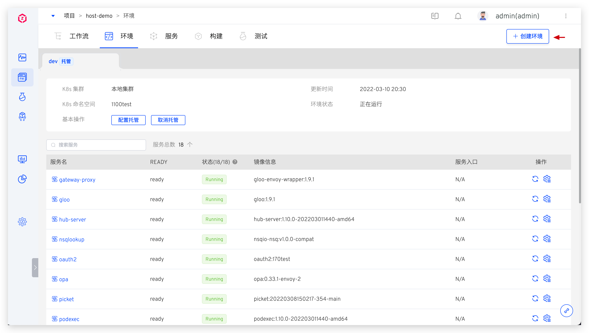

参数说明：

- `环境名称`：填写环境名称
- `K8s 集群`：要被托管的服务所在的 K8s 集群，注意：该集群需事先在 Zadig 中集成，可参考[集群管理](/v1.10.0/pages/cluster_manage)操作
- `K8s 命名空间`：要被托管的服务所在的 K8s 命名空间
- `选择服务`：要被托管的服务

### 查看环境

点击不同的环境 Tab 即可查看该环境及环境中被托管服务的详情。

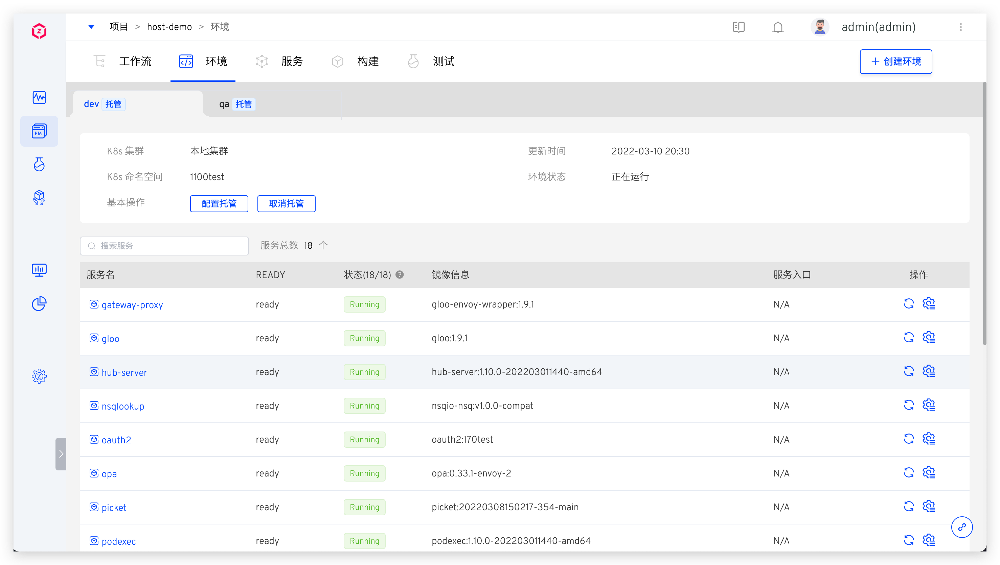

#### 基本信息
包括 K8s 集群，K8s 命名空间，更新时间，环境状态等信息，其中环境状态有以下几种情况：
- `创建中`：正在创建。
- `正在运行`：环境中所有服务都是正常的 Running 状态。
- `运行不稳定`：环境中一部分服务处于 Unstable 状态，可能的情况有两种：
	- 容器服务出现了问题.
	- 容器服务正在进行更新操作，例如更新镜像，会出现短时间的服务 Unstable，当更新过程完成之后，服务状态会恢复为 Running。

#### 服务列表

服务列表中展示了当前环境下所有被托管的服务，相关参数说明：

- `状态`：服务的运行状态
- `镜像信息`：当前服务运行的镜像，可点击服务名在服务详情页进行修改
- `服务入口`：如果该服务存在 Ingress 信息，则会展示
- `操作`：快速重启服务

#### 查看服务详情

在服务列表中点击具体的服务可查看该托管服务的更多信息，具体请阅读[服务详情](#服务详情)。

### 配置托管

点击基本操作中的`配置托管`，对当前环境下被托管的服务进行管理，按需添加或移除：

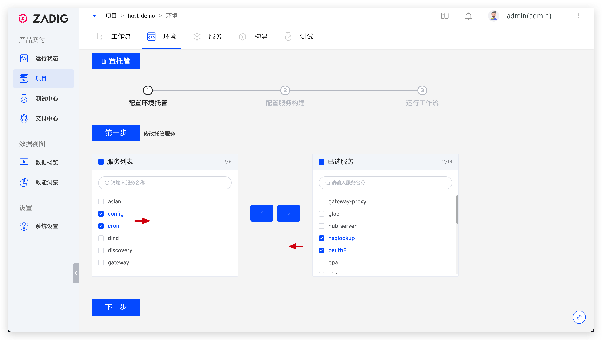

### 取消托管

点击基本操作中的`取消托管`，可取消对当前环境中服务的托管。

## 服务详情

在服务列表中点击服务名即可进入服务详情页面。服务详情页面展示了服务的详细信息，用户可以对服务进行服务重启、服务伸缩、配置管理、更新镜像等操作。

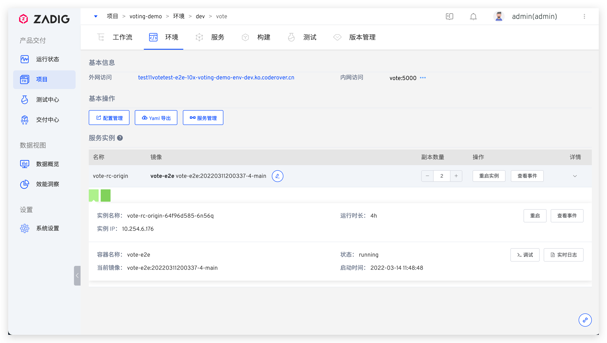

### 基本信息
服务基本信息展示了服务的外网访问信息，以及内网 Service 访问信息。

- `外网访问`：服务的 Ingress 配置信息
- `内网访问`：服务的 Service 配置信息

### 基本操作
> K8s YAML 项目和 K8s Helm Chart 项目中有此功能。

- `配置管理`: 查看和编辑该服务的相关配置
- `YAML 导出`: 将服务信息导出为 K8s YAML 形式
- `服务管理`: 链接到该服务的模板详情

### 服务实例操作
- `镜像更新`：点击镜像右侧的编辑按钮，可更新该服务使用的镜像，选择新的镜像后容器会自动拉取并更新镜像，同时进行重启
- `重启实例`：点击按钮重启该服务
- `查看事件`：查看 Pod Event
- `副本数量`：动态调整服务的副本数量

### 服务实例详情

服务实例详情列表显示了容器服务所有的实例，切换实例后可查看每个服务实例（Pod）下的容器（Container）详细信息。

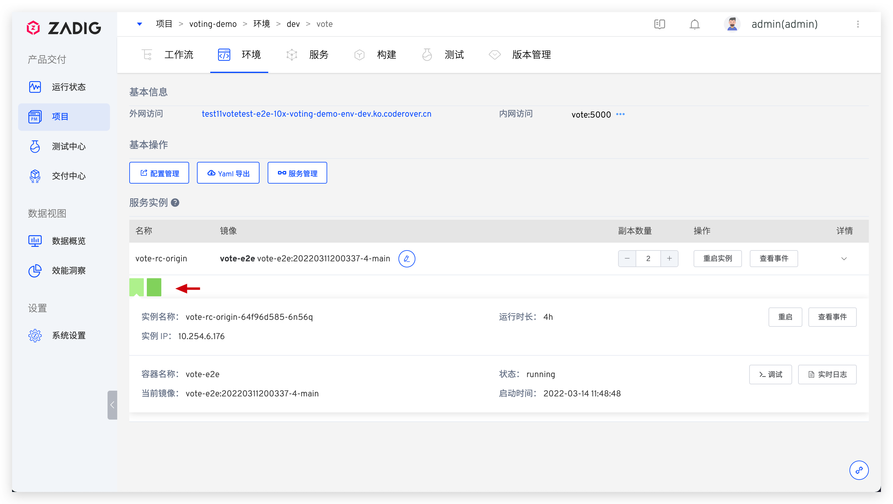

用户可对单个服务实例进行操作：

- `重启实例`：重启单个实例
- `实时日志`：查看当前服务实例的实时日志
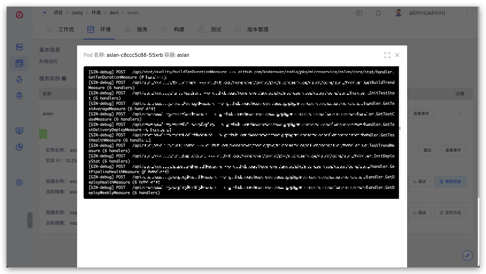
- `查看事件`：查看当前服务实例 Pod Event 事件
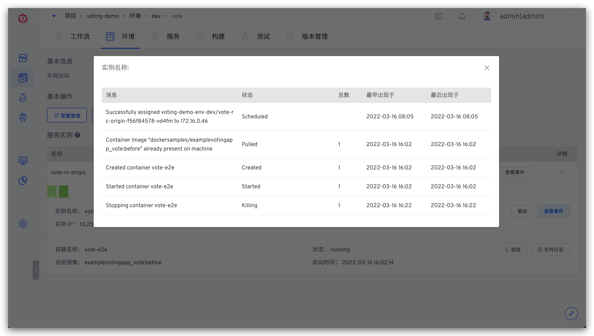
