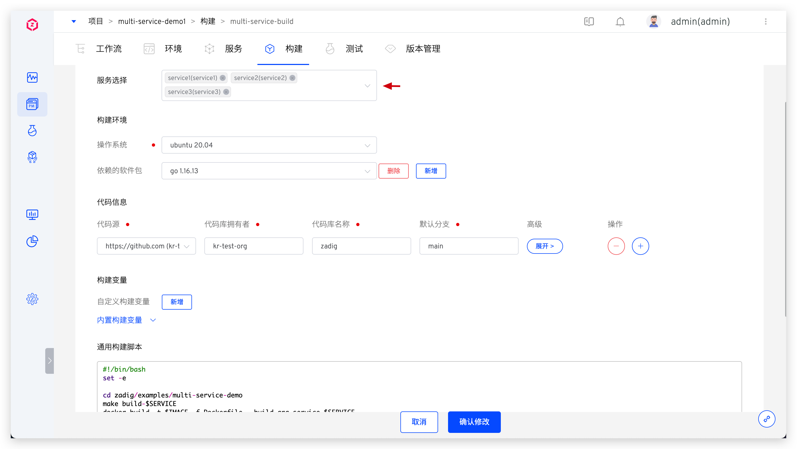
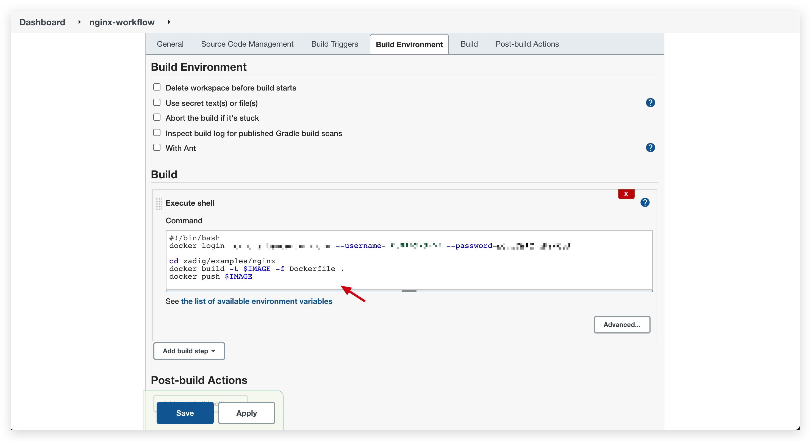
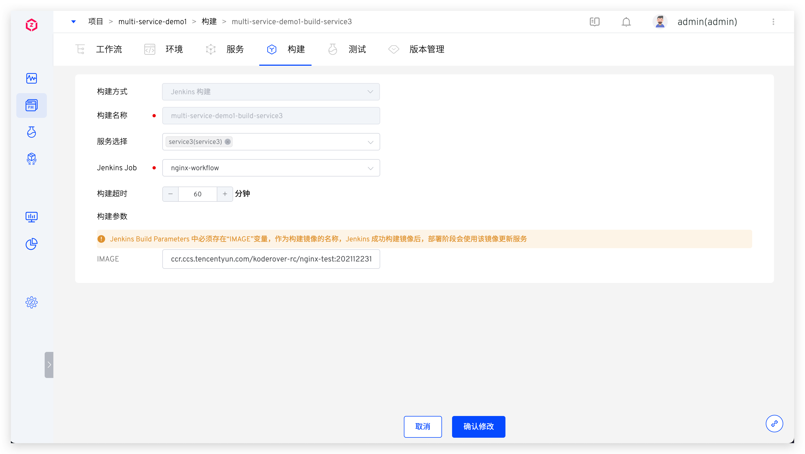
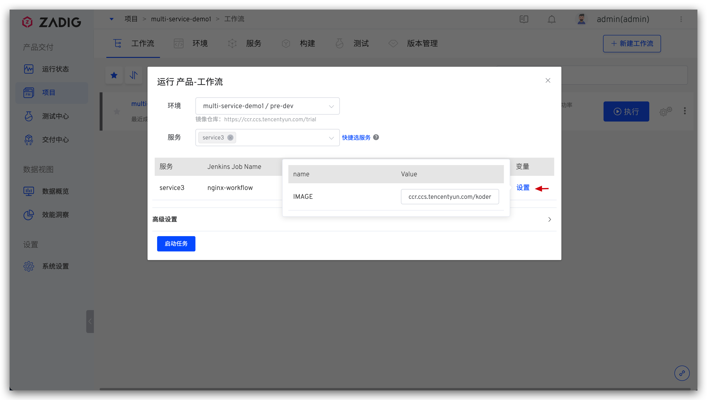

Zadig 构建是基于容器运行时环境提供的高效云原生构建引擎，内置了常见的构建环境及软件包、缓存机制，支持多个服务共享构建脚本及 Jenkins 构建的调用，还可以通过自定义[构建镜像](/v1.10.0/settings/custom-image) 及 [安装软件包](/v1.10.0/settings/app/) 满足更为丰富的构建场景。

Zadig 构建过程包含通用配置、构建环境、代码信息、构建变量、通用构建脚本、高级配置以及自定义更多步骤配置等。


## Zadig 构建

- 支持多个服务使用一份构建配置，更多细节请阅读[共享构建](#Zadig-共享构建)。
- 支持修改构建交付物的生成规则，更多细节请阅读[构建交付产物生成规则](/v1.10.0/project/service/#策略配置)。

### 定义构建

::: tip 准备工作
明确构建所需要的依赖，依赖项包括但不限于：
- 服务编译的代码依赖（比如依赖 Base 库，开源库等）
- 服务编译的环境依赖（比如 Go 版本、Node 版本、编译工具等）
- 服务编译的系统依赖（比如操作系统等）
:::

### 基本配置


参数说明：
- `构建名称`：构建的名称，有意义便于理解即可。
- `服务选择`：选择使用该构建配置的服务。

### 构建环境

配置构建过程运行时的环境。


参数说明：
- `操作系统`：平台默认提供 Ubuntu 16.04/Ubuntu 18.04/Ubuntu 20.04 作为基础构建系统。

::: tip 扩展知识

1. 支持自定义添加构建环境作为构建系统，详情请参阅[构建镜像管理](/v1.10.0/settings/custom-image/#步骤-1-生成构建镜像)。
2. 默认提供的 Ubuntu 系列构建系统中已安装了以下工具/命令，可以在[软件包管理](/v1.10.0/settings/app/)和构建脚本中直接使用。

    - build-essential
    - cmake
    - curl
    - docker
    - git
    - libfontconfig
    - libfreetype6-dev
    - libpcre3-dev
    - librrd-dev
    - libsasl2-dev
    - netcat-openbsd
    - pkg-config
    - python
    - tar
    - wget
:::

- `依赖的软件包`：构建过程中需要用到的各类软件包工具，比如不同版本的 Java、Go、Govendor、Node、Bower、Yarn、Phantomjs 等等。

::: tip 扩展知识
- 选择软件包的过程中需要注意多个软件包之间的依赖关系，按照顺序进行安装。例如：Govendor 依赖 Go，那么必须先选 Go，再选择 Govendor。<br>
- 平台已内置一些常见的软件包，如果有其他软件包或者版本需求，系统管理员可以在[软件包管理](/v1.10.0/settings/app)中配置其安装脚本。
:::

### 代码信息


参数说明：
- `代码源`：代码库所在的平台，目前支持 GitHub、GitLab、Gerrit、CodeHub
- `代码库拥有者`：支持开源库，以及所配置的代码源下的代码库拥有者
- `代码库名称`：代码库的名称
- `默认分支`：执行工作流对服务进行构建时，默认选取的分支
- `Remote name`：指定远程代码仓库的名称，默认 `origin`
- `克隆目录名`：定义代码库被克隆后的目录名称，默认为代码库的名称
- `子模块`：同步 `submodule` 中配置的代码库

:::: tip
- 指定`克隆目录名`为 A，则代码库的内容将会被克隆到 `$WORKSPACE/A` 中
- `$WORKSPACE` 是 Zadig 系统构建模块内置的变量，关于其更详细的描述可阅：[系统内置环境变量](/v1.10.0/project/build/#构建脚本)
::::

### 构建变量

包括系统内置构建变量和用户自定义构建变量，可在构建脚本中直接使用。


**内置构建变量**

内置变量及其描述说明如下：

|变量名称|描述|
|-------|---|
|`WORKSPACE`|当前工作流工作目录|
|`TASK_ID`|当前工作流任务的 ID，即任务序号|
|`IMAGE`|输出镜像名称，用于容器服务的部署更新|
|`PKG_FILE`|交付物文件名称|
|`SERVICE`|编译的服务名称|
|`DIST_DIR`|构建出的 Tar 包的目的目录|
|`ENV_NAME`|环境名称|
|`BUILD_URL`|构建任务的 URL|
|`CI`|值恒等于 true，可视需要使用，比如用于判断是 CI 脚本，还是其他脚本|
|`ZADIG`|值恒等于 true，可视需要使用，比如用于判断是否在 Zadig 系统中执行|
|`<REPO>_PR`|构建过程中指定代码仓库使用的 Pull Request 信息|
|`<REPO>_BRANCH`|构建过程中指定代码仓库使用的分支信息|
|`<REPO>_TAG`|构建过程中指定代码仓库使用的 Tag 信息|
|`<REPO>_COMMIT_ID`|构建过程中指定代码仓库使用的 Commit ID 信息|

::: tip
1. 如果 REPO 中包含中划线 "-"，将 "-" 替换成 "_" 即可正常获取变量 `<REPO>_PR`、`<REPO>_BRANCH`、`<REPO>_TAG`、`<REPO>_COMMIT_ID` 。

2. 系统有内置的规则生成 `IMAGE` 和 `PKG_FILE`，关于规则的查看和修改，请参考：[构建交付物生成规则](/v1.10.0/project/build/#构建交付物生成规则)。
:::

**自定义构建变量**

说明：

- 支持使用字符串类型或者枚举类型的构建变量。
- 可以设置字符串类型的变量为敏感信息。设置为敏感信息后，工作流任务的构建日志中将不会再输出其明文信息。
- 执行工作流任务时，也可以对自定义构建变量的值进行修改，覆盖此处配置的默认值，如下图所示：


### 通用构建脚本

在通用构建脚本中声明代码的构建过程和实现。

> 可在通用构建脚本中使用[构建变量](#构建变量)


### 高级配置


说明：

- `策略配置`：配置构建服务的超时时间，若超过设置的时间阈值后构建仍未成功，则视为超时失败。
- `缓存配置`：开启缓存后，在工作流执行时会使用此处配置的缓存目录
- `资源配置`：选择构建任务运行时所使用的集群资源，其中本地集群指 Zadig 系统所在的集群，关于集群的集成可参考[集群管理](/v1.10.0/pages/cluster_manage/)。
- `操作系统规格`：配置资源规格用于执行构建任务。平台提供 高/中/低/最低 四种配置供选择，可以根据实际需要自定义规格。参考[自定义镜像管理](/v1.10.0//settings/custom-image/)。

### 更多构建步骤

在`添加步骤`中可按需添加更多的构建步骤。


**镜像构建**
参数说明：

- `构建上下文目录:` 执行 docker build 所在的目录。
- `Dockerfile 来源:` 包括`代码库`和`模板库`，模板库功能可参考 [Dockerfile 模板管理](/v1.10.0/template/dockerfile/)
- `Dockerfile 文件的绝对路径:` Dockerfile 来源于代码库时，指定执行 docker build 用到的 Dockerfile 路径。
- `模板选择:` Dockerfile 来源于模板库时，选择具体的 Dockerfile 模板。
- `构建参数:` 支持 docker build 的所有参数，比如：`--build-arg key1=value1 --build-arg key2=value2`。

**二进制包存储**

配置构建出的二进制包产物的存储路径。

**Shell 脚本执行**

新增 Shell 脚本执行步骤，按需自定义 Shell 脚本。

## Zadig 共享构建

> 同一个项目下的多个服务共享使用一份构建配置。

### 如何配置共享构建

以 [multi-service-demo](https://github.com/koderover/zadig/tree/main/examples/multi-service-demo) 为例，该项目包括 3 个 Golang 服务 service1/service2/service3，和构建相关的目录结构说明如下：

``` bash
├── Dockerfile # 定义 3 个服务的 Dockerfile
├── Makefile   # 定义 3 个服务的编译
├── src        # 3 个服务的源代码
   ├── service1
   ├── service2
   └── service3
```

创建 Zadig 构建，`服务选择`中选择多个服务，按需配置构建环境、代码信息、通用构建脚本等，利用系统提供变量实现构建的共享，本示例中的构建脚本如下：

```bash
cd zadig/examples/multi-service-demo
make build-$SERVICE
docker build -t $IMAGE -f Dockerfile --build-arg service=$SERVICE .
docker push $IMAGE
```



### 如何使用共享构建

- 创建构建配置时指定多个服务，或者创建构建完毕后修改构建，在`服务选择`中选择多个服务。


- 也可以在为服务配置构建时，按需选择复用已有的构建配置实现构建共享。


## Jenkins 构建
> 直接使用 Jenkins Job 执行后的镜像产物，用于部署更新 Zadig 中的服务。

关于`Zadig 构建`和 `Jenkins 构建` 二者的区别如下：

- Zadig 构建：在 Zadig 平台中定义服务的完整构建过程。
- Jenkins 构建：关于服务具体的构建过程在 Jenkins 中定义执行，Zadig 中提供入口触发具体的 Jenkins Job，并基于 Jenkins Job 的镜像产物对部署在 Zadig 中的服务进行更新。

### 前提
1. 需要先在 Zadig 系统中集成 Jenkins 服务器，详见 [Jenkins 集成](/v1.10.0/settings/jenkins)。
2. 需要先在 Zadig 系统中集成镜像仓库，详见[镜像仓库管理](/v1.10.0/settings/image-registry/)。
3. 要使用的 Jenkins Job 中需要配置 Build Parameters，包含 `IMAGE` 变量，作为构建出的镜像产物， 并将 `IMAGE` 推送至集成的镜像仓库中，示例如下：




### 如何使用


新建构建，构建来源选择 `Jenkins 构建`，填写相关参数保存即可。参数说明如下：
- `服务选择`：要构建的服务。
- `jenkins job`：从集成的 Jenkins Server 中按需选择 Jenkins Job。
- `构建参数`：`IMAGE` 参数，在运行工作流的时候可以手动输入，传递给 Jenkins Job 作为构建镜像产物名称，如下图所示：


