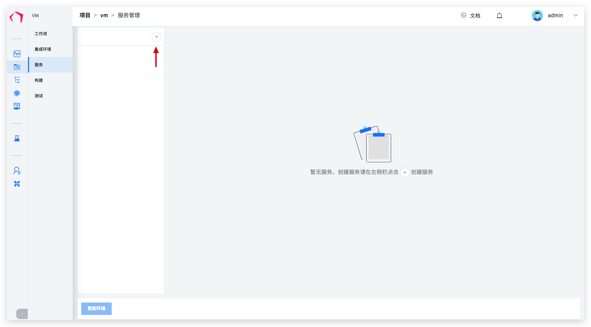
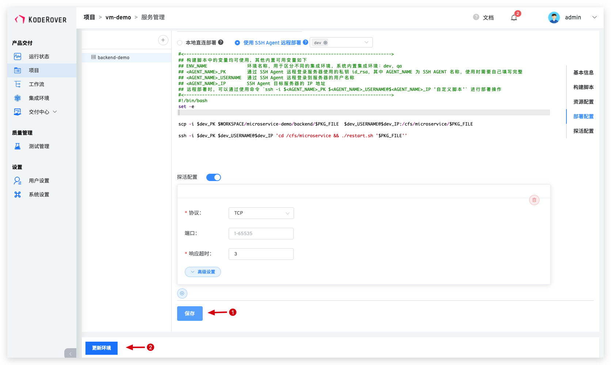
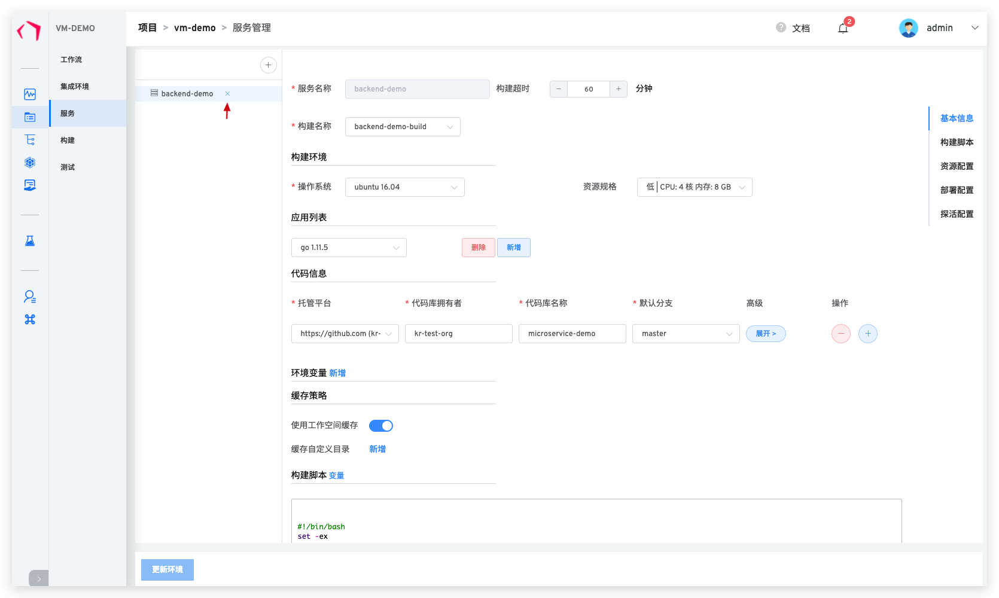

本文介绍 Zadig 服务相关的操作。Zadig 的服务可以是一组 Kubernetes 资源集合（下面简称 K8s YAML）、一个完整的 Helm Chart 或者是云主机/物理机服务。下面针对分别介绍这三种类型的服务操作。

## K8s YAML 服务
### 新增服务

项目中选择点击服务部分，进入服务管理页面。


K8s YAML 服务的创建支持平台管理和代码仓库托管两种方式：
- `平台管理`：服务的 Kubenertes YAML 配置存储到 Zadig 系统中
- `仓库托管`：将服务用到的 YAML（包括服务配置使用的 Configmap）托管到代码仓库中，通过 Zadig 平台配置好文件的路径目录后，Zadig 从代码仓库同步，支持两种同步方式：
  - 手动同步：点击`加载`按钮，获取仓库中最新的配置
  - 自动同步：通过配置 Webhook（参阅 [配置 GitLab Webhook](/settings/webhook-config/)），Zadig 监听分支上有代码改动，对应的服务都会自动同步。

#### 平台管理

* 点击新建按钮新建服务。


* 输入新的服务名称。


* 将服务 YAML 填入编辑器并保存。


* 更新环境，该服务会自动加入到选择的环境中。


#### 仓库托管

* 选择仓库托管，选择代码仓库
* 选择服务配置所在文件目录，加载服务

### 更新服务

#### 平台管理

* 修改服务 YAML并保存。


* 选择相应环境进行更新。


#### 仓库托管

* 提交服务配置变更到代码仓库


* 变更合并到主干分支后，通过 Webhook 的能力自动同步最新配置到 Zadig 系统。也可以在界面上手动同步服务配置，如下图所示。


* 在 Zadig 集成环境中，查看服务配置的变更，点击服务更新按钮执行更新操作


### 删除服务

* 从`服务` 模块中将服务配置删除。
* 更新环境，将删除的服务从相应环境中移除。


<!-- ### 共享服务
### 服务编排 -->
### 服务 YAML 样例
#### 无状态服务

概念：服务运行的实例不会在本地存储需要持久化的数据，并且多个实例对于同一个请求响应的结果是完全一致的。可以参考[这篇文章](https://kubernetes.io/zh/docs/tasks/run-application/run-stateless-application-deployment/)了解无状态服务的更多细节。
::: details
```yaml
apiVersion: apps/v1
kind: Deployment
metadata:
  name: nginx-deployment
spec:
  selector:
    matchLabels:
      app: nginx
  replicas: 2 # 2 个 Pod 实例
  template:
    metadata:
      labels:
        app: nginx
    spec:
      containers:
      - name: nginx
        image: nginx:1.14.2
        ports:
        - containerPort: 80
```
:::
#### 有状态服务

概念：服务的实例可以将一部分数据随时进行备份，并且在创建一个新的有状态服务时，可以通过备份恢复这些数据，以达到数据持久化的目的。可以参考[这篇文章](https://kubernetes.io/zh/docs/tasks/run-application/run-replicated-stateful-application/)了解有状态服务的更多细节。
::: details
```yaml
apiVersion: v1
kind: ConfigMap
metadata:
  name: mysql
  labels:
    app: mysql
data:
  master.cnf: |
    # Apply this config only on the master.
    [mysqld]
    log-bin
  slave.cnf: |
    # Apply this config only on slaves.
    [mysqld]
    super-read-only
---
# Headless service for stable DNS entries of StatefulSet members.
apiVersion: v1
kind: Service
metadata:
  name: mysql
  labels:
    app: mysql
spec:
  ports:
  - name: mysql
    port: 3306
  clusterIP: None
  selector:
    app: mysql
---
# Client service for connecting to any MySQL instance for reads.
# For writes, you must instead connect to the master: mysql-0.mysql.
apiVersion: v1
kind: Service
metadata:
  name: mysql-read
  labels:
    app: mysql
spec:
  ports:
  - name: mysql
    port: 3306
  selector:
    app: mysql
---
apiVersion: apps/v1beta1
kind: StatefulSet
metadata:
  name: mysql
spec:
  selector:
    matchLabels:
      app: mysql
  serviceName: mysql
  # 1 master and 2 slave
  replicas: 3
  template:
    metadata:
      labels:
        app: mysql
    spec:
      initContainers:
      - name: init-mysql
        image: mysql:5.7
        command:
        - bash
        - "-c"
        - |
          set -ex
          # Generate mysql server-id from pod ordinal index.
          [[ `hostname` =~ -([0-9]+)$ ]] || exit 1
          ordinal=${BASH_REMATCH[1]}
          echo [mysqld] > /mnt/conf.d/server-id.cnf
          # Add an offset to avoid reserved server-id=0 value.
          echo server-id=$((100 + $ordinal)) >> /mnt/conf.d/server-id.cnf
          # Copy appropriate conf.d files from config-map to emptyDir.
          if [[ $ordinal -eq 0 ]]; then
            cp /mnt/config-map/master.cnf /mnt/conf.d/
          else
            cp /mnt/config-map/slave.cnf /mnt/conf.d/
          fi
        volumeMounts:
        - name: conf
          mountPath: /mnt/conf.d
        - name: config-map
          mountPath: /mnt/config-map
      - name: clone-mysql
        image: gcr.azk8s.cn/google-samples/xtrabackup:1.0
        command:
        - bash
        - "-c"
        - |
          set -ex
          # Skip the clone if data already exists.
          [[ -d /var/lib/mysql/mysql ]] && exit 0
          # Skip the clone on master (ordinal index 0).
          [[ `hostname` =~ -([0-9]+)$ ]] || exit 1
          ordinal=${BASH_REMATCH[1]}
          [[ $ordinal -eq 0 ]] && exit 0
          # Clone data from previous peer.
          ncat --recv-only mysql-$(($ordinal-1)).mysql 3307 | xbstream -x -C /var/lib/mysql
          # Prepare the backup.
          xtrabackup --prepare --target-dir=/var/lib/mysql
        volumeMounts:
        - name: data
          mountPath: /var/lib/mysql
          subPath: mysql
        - name: conf
          mountPath: /etc/mysql/conf.d
      containers:
      - name: mysql
        image: mysql:5.7
        env:
        - name: MYSQL_ALLOW_EMPTY_PASSWORD
          value: "1"
        ports:
        - name: mysql
          containerPort: 3306
        volumeMounts:
        - name: data
          mountPath: /var/lib/mysql
          subPath: mysql
        - name: conf
          mountPath: /etc/mysql/conf.d
        resources:
          requests:
            cpu: 500m
            memory: 1Gi
          limits:
            cpu: 500m
            memory: 1Gi
        livenessProbe:
          exec:
            command: ["mysqladmin", "ping"]
          initialDelaySeconds: 30
          periodSeconds: 10
          timeoutSeconds: 5
        readinessProbe:
          exec:
            # Check we can execute queries over TCP (skip-networking is off).
            command: ["mysql", "-h", "127.0.0.1", "-e", "SELECT 1"]
          initialDelaySeconds: 5
          periodSeconds: 2
          timeoutSeconds: 1
      - name: xtrabackup
        image: gcr.azk8s.cn/google-samples/xtrabackup:1.0
        ports:
        - name: xtrabackup
          containerPort: 3307
        command:
        - bash
        - "-c"
        - |
          set -ex
          cd /var/lib/mysql

          # Determine binlog position of cloned data, if any.
          if [[ -f xtrabackup_slave_info && "x$(<xtrabackup_slave_info)" != "x" ]]; then
            # XtraBackup already generated a partial "CHANGE MASTER TO" query
            # because we're cloning from an existing slave. (Need to remove the tailing semicolon!)
            cat xtrabackup_slave_info | sed -E 's/;$//g' > change_master_to.sql.in
            # Ignore xtrabackup_binlog_info in this case (it's useless).
            rm -f xtrabackup_slave_info xtrabackup_binlog_info
          elif [[ -f xtrabackup_binlog_info ]]; then
            # We're cloning directly from master. Parse binlog position.
            [[ `cat xtrabackup_binlog_info` =~ ^(.*?)[[:space:]]+(.*?)$ ]] || exit 1
            rm -f xtrabackup_binlog_info xtrabackup_slave_info
            echo "CHANGE MASTER TO MASTER_LOG_FILE='${BASH_REMATCH[1]}',\
                  MASTER_LOG_POS=${BASH_REMATCH[2]}" > change_master_to.sql.in
          fi

          # Check if we need to complete a clone by starting replication.
          if [[ -f change_master_to.sql.in ]]; then
            echo "Waiting for mysqld to be ready (accepting connections)"
            until mysql -h 127.0.0.1 -e "SELECT 1"; do sleep 1; done

            echo "Initializing replication from clone position"
            mysql -h 127.0.0.1 \
                  -e "$(<change_master_to.sql.in), \
                          MASTER_HOST='mysql-0.mysql', \
                          MASTER_USER='root', \
                          MASTER_PASSWORD='', \
                          MASTER_CONNECT_RETRY=10; \
                        START SLAVE;" || exit 1
            # In case of container restart, attempt this at-most-once.
            mv change_master_to.sql.in change_master_to.sql.orig
          fi

          # Start a server to send backups when requested by peers.
          exec ncat --listen --keep-open --send-only --max-conns=1 3307 -c \
            "xtrabackup --backup --slave-info --stream=xbstream --host=127.0.0.1 --user=root"
        volumeMounts:
        - name: data
          mountPath: /var/lib/mysql
          subPath: mysql
        - name: conf
          mountPath: /etc/mysql/conf.d
        resources:
          requests:
            cpu: 100m
            memory: 100Mi
      volumes:
      - name: conf
        emptyDir: {}
      - name: config-map
        configMap:
          name: mysql
  volumeClaimTemplates:
  - metadata:
      name: data
    spec:
      accessModes: ["ReadWriteOnce"]
      resources:
        requests:
          storage: 10Gi
```
:::
## 云主机/物理机服务

在 Zadig 系统上云主机/物理机服务的定义主要包括服务的构建脚本、资源配置、部署配置和探活配置。

### 新增服务

- 项目中点击服务部分，进入服务管理页面。


- 点击新建按钮新建服务。



- 输入服务名称。


- 配置构建脚本，定义服务的构建打包过程。

云主机/物理机服务的构建脚本相关配置说明，参考[构建模块](/project/build/)。

- 资源配置，关联对应集成环境使用的主机资源。

> 需事先在`系统设置` -> `主机管理` 中添加主机资源，参考[主机管理](/settings/vm-management/)。


- 配置部署脚本，定义服务的部署过程。


说明：
1. 部署方式：
    - `本地直连部署`：直接在 zadig 所在集群中执行部署操作，需确保 Zadig 系统能连通或访问到脚本中的主机地址。
    - `使用 SSH Agent 远程部署`：安全登陆到目标机器，执行部署操作。
2. 部署脚本和构建脚本共享存储卷，在构建脚本中生成的包在部署脚本中直接获取。
3. 部署脚本可以使用构建脚本中系统内置变量，构建包需使用 `$PKG_FILE` 获取。

- 配置探活


字段说明：
1. `协议`：支持 HTTP、HTTPS 和 TCP。
2. `路径`：HTTP/HTTPS 请求的健康检查路径。
3. `端口`：支持 1 - 65535 端口。
4. `响应超时`：超出设定时间，判断为不健康。
5. `高级设置`：
    - `探测间隔`：两次探活请求的间隔时间，默认 2s。
    - `健康阈值`：从不健康变为健康的连续探测次数。
    - `不健康阈值`：从健康变为不健康的连续探测次数。


### 更新服务

- 选择需要修改的服务。


- 修改服务配置，点击`保存`-> 点击`更新环境`->在弹框中选择需要更新的环境。




### 删除服务

- 从 `服务` 模块中将服务配置删除。



- 更新环境，将删除的服务从相应的环境中移除。


## Helm Chart 服务
> 文档建设中，敬请期待……

