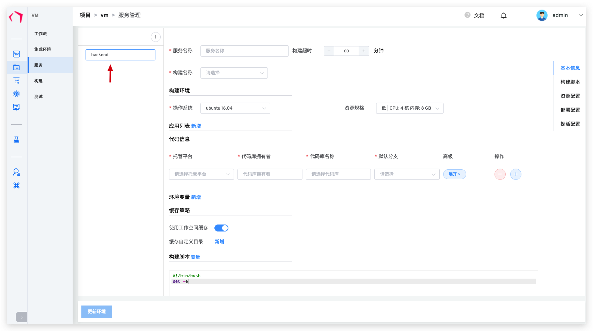
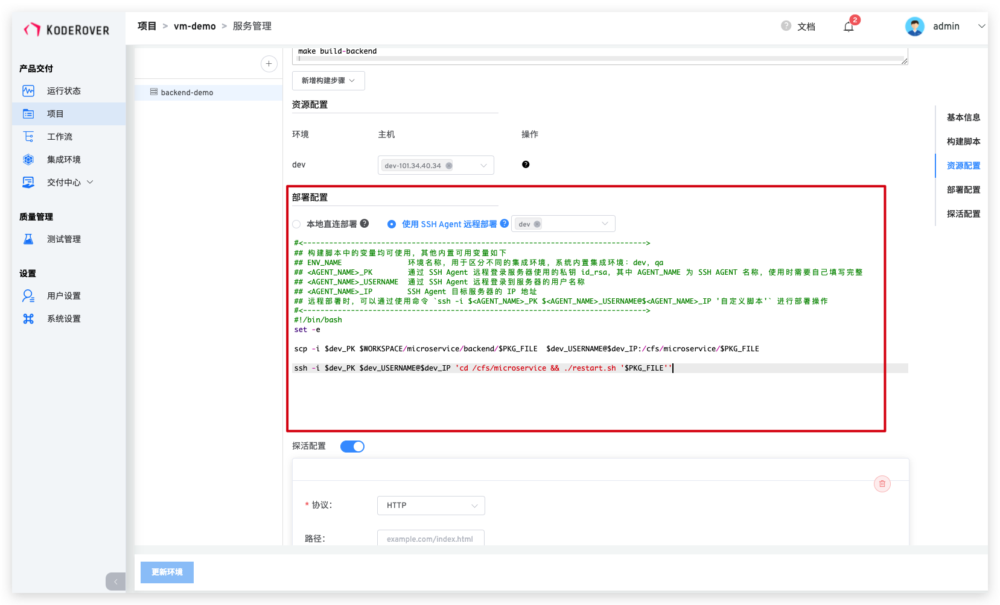
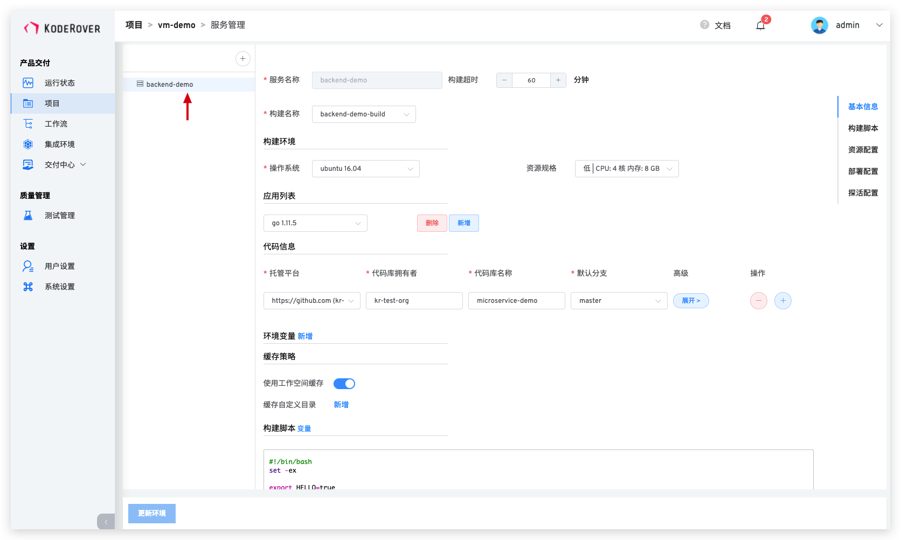
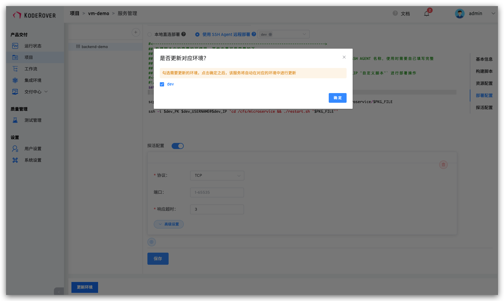
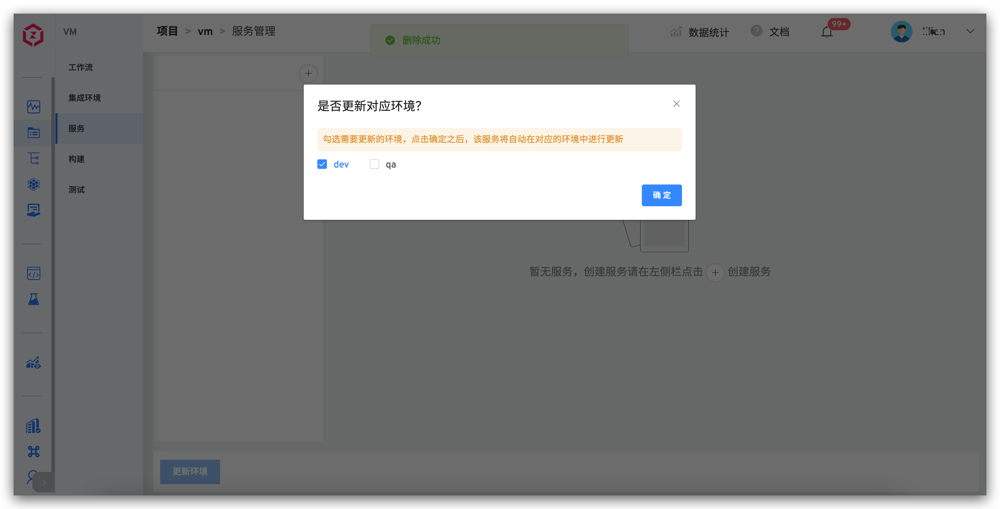

## 主机服务

在 Zadig 系统上主机服务的定义主要包括服务的构建脚本、资源配置、部署配置和探活配置。

### 新增服务

- 项目中点击服务部分，进入服务管理页面。

- 点击新建按钮新建服务。

- 输入服务名称。

- 配置构建脚本，定义服务的构建打包过程。

主机服务的构建脚本相关配置说明，参考[构建模块](/project/build/)。

- 资源配置，关联对应集成环境使用的主机资源。

> 需事先在`系统设置` -> `主机管理` 中添加主机资源，参考[主机管理](/settings/vm-management/)。

- 配置部署脚本，定义服务的部署过程。

说明：
1. 部署方式：
    - `本地直连部署`：直接在 Zadig 所在集群中执行部署操作，需确保 Zadig 系统能连通或访问到脚本中的主机地址。
    - `使用 SSH Agent 远程部署`：安全登录到目标机器，执行部署操作。
2. 部署脚本和构建脚本共享存储卷，在构建脚本中生成的包在部署脚本中直接获取。
3. 部署脚本可以使用构建脚本中系统内置变量，构建包需使用 `$PKG_FILE` 获取。

- 配置探活

字段说明：
1. `协议`：支持 HTTP、HTTPS 和 TCP。
2. `路径`：HTTP/HTTPS 请求的健康检查路径。
3. `端口`：支持 1 - 65535 端口。
4. `响应超时`：超出设定时间，判断为不健康。
5. `高级设置`：
    - `探测间隔`：两次探活请求的间隔时间，默认 2s。
    - `健康阈值`：从不健康变为健康的连续探测次数。
    - `不健康阈值`：从健康变为不健康的连续探测次数。

### 更新服务

- 选择需要修改的服务。

- 修改服务配置，点击`保存`-> 点击`更新环境`->在弹框中选择需要更新的环境。

### 删除服务

- 从 `服务` 模块中将服务配置删除。

- 更新环境，将删除的服务从相应的环境中移除。

