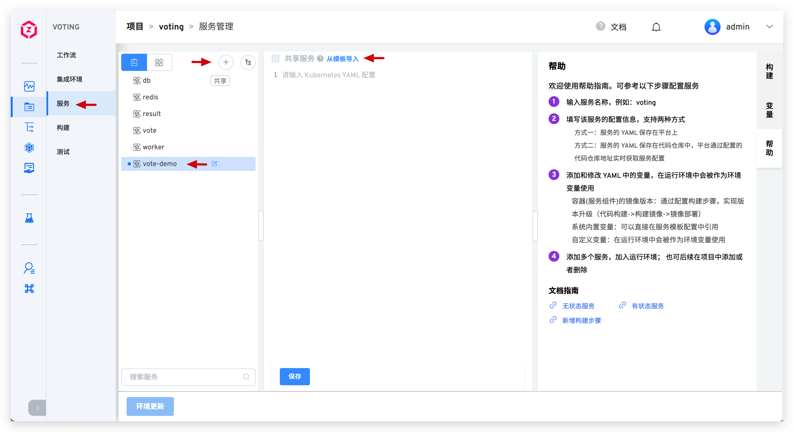
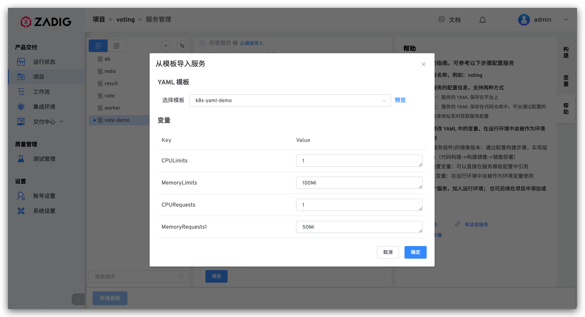
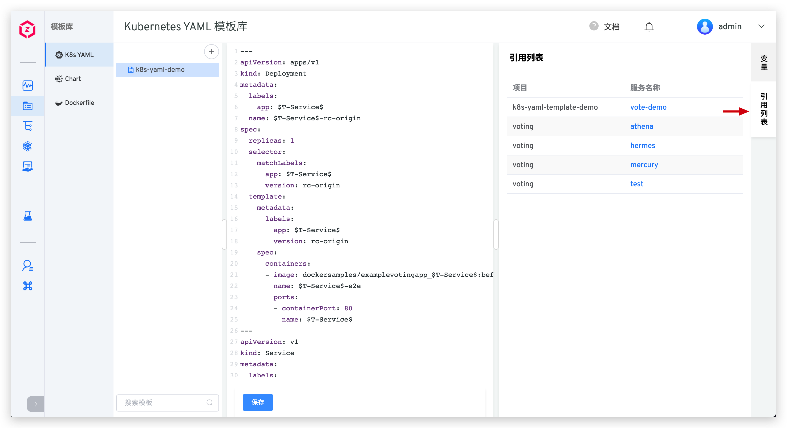

::: tip 版本信息
在 Zadig <Badge text="v1.6.0"/> 及以上版本中提供了</img> K8s YAML 模板能力，支持用户在通用的模板上创建服务，提供更大的可扩展性。
:::

## 新建 K8s YAML 模板

> 可将 K8s 资源的 YAML 配置文件抽象，在项目中创建服务时基于模板库对服务进行定义。

- 依次访问`项目`-`模板库`-`K8s YAML` 进入到 K8s YAML 模板库的管理页面，点击`+`按钮后输入 K8s YAML 模板名字并在右侧填写模板内容。模板内容保存成功后，系统会自动解析出模板中所使用变量。

::: tip 小贴士
K8s YAML 模板在整个系统内均有效，可被应用到不同的项目中使用。
:::

### 变量列表
> 包括系统内置变量和自定义变量。

- 系统内置变量包括 `$T-Project$` 和 `$T-Service$`，可直接在 K8s YAML 模板中使用。在项目中基于模板创建服务后，二者会自动被替换为对应的项目名称和服务名称。
- 可以在 K8s YAML 模板中自定义变量并赋予默认值，在项目中基于模板创建服务时，可修改自定义变量的值重新对服务进行定义。

::: tip 扩展知识

1. 系统支持对类型是 Deployment、Statefulset、Job 以及 CronJob 的 K8s 资源进行部署更新。

2. 上述四种类型资源的名称定义不能使用自定义变量。

3. Deployment 中的镜像名称定义不能使用自定义变量。

:::

## 使用 K8s YAML 模板

- 访问项目的服务模块，点击`+`按钮新建服务，输入服务名称后，点击`从模板导入`。

- 选择具体的 K8s YAML 模板后，可修改模板中预定义的变量值。点击`确定`后即可基于模板和新的赋值创建服务成功。

## 查看 K8s YAML 模板引用列表

点击 K8s YAML 模板右侧的`引用列表`，即可查看引用了该模板的项目和服务列表

